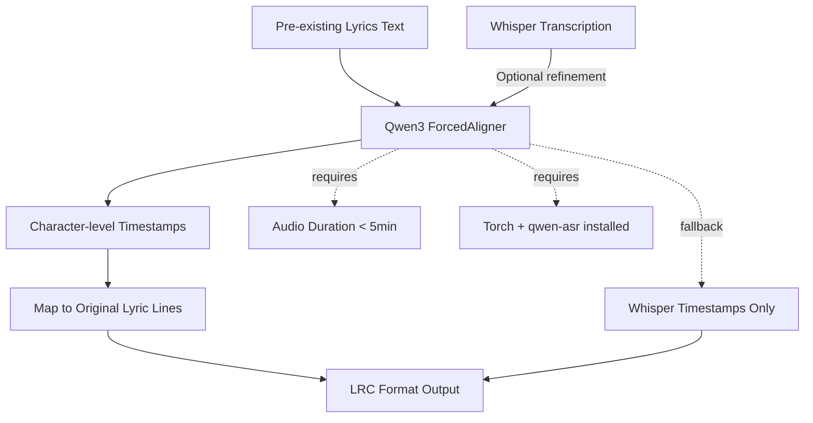

# Features Research: Qwen3 ForcedAligner for LRC Generation

**Domain:** LRC Generation for Chinese Worship Lyrics Videos
**Researched:** 2026-02-13
**Confidence:** MEDIUM
**Research Mode:** Features dimension (subsequent milestone — adding forced alignment to existing LRC pipeline)

## Context

**Milestone:** v1.1 Qwen3 LRC Refinement — Adding forced alignment capabilities to an existing LRC pipeline.

**Existing features (already built):**
- Whisper transcription with word-level timestamps
- LLM alignment to match transcribed phrases to known lyrics
- LRC file generation
- Job queue for async processing

**Project problem:** Lyrics display early or late in the generated video.
- Current: Whisper + LLM gets approximate timing but not precise enough
- Goal: Use Qwen3 to refine timestamps for accurate lyrics display

---

## Feature Landscape

### Table Stakes (Forced Alignment Baseline)

Features users expect from ANY forced aligner. Missing these = product feels incomplete.

| Feature | Why Expected | Complexity | Notes |
|---------|--------------|------------|-------|
| **Precise timestamp extraction** | Core function — align text to audio timing | Low | Must output (start_time, end_time, text) for each aligned segment |
| **Support for known text input** | Forced alignment requires pre-existing lyrics | Low | Takes lyrics as input, doesn't transcribe new text from audio |
| **Character/word-level granularity** | Line-level timing insufficient for karaoke/subtitles | Medium | Fine-grained alignment required for precise display synchronization |
| **Multi-segment handling** | Songs have verses, choruses, bridges that repeat | Medium | Must handle repeated sections without confusion |
| **Language detection/hinting** | Chinese lyrics need explicit language specification | Low | Language parameter essential for accurate Chinese character alignment |
| **Model loading & caching** | Download 0.6B model once, reuse across requests | Low | ~1.2GB model file, HuggingFace caching integration |
| **Device flexibility** | Deploy on CPU/MPS/CUDA based on environment | Low | Auto-device detection required for portable deployment |
| **Error handling/fallback** | Alignment may fail, must degrade gracefully | Medium | Fall back to Whisper timestamps when forced alignment fails |
| **Dtype configuration** | Hardware-specific precision (bf16/fp16/fp32) | Low | Balance speed vs accuracy based on hardware capabilities |

### Differentiators (Qwen3-Specific Advantages)

Features that set Qwen3-ForcedAligner apart. Not expected from all forced aligners, but valued.

| Feature | Value Proposition | Complexity | Notes |
|---------|-------------------|------------|-------|
| **~2-40x lower alignment errors** | Drastic improvement over Monotonic-Aligner, NFA, WhisperX | Low | Benchmarks show 27.8ms avg error on human-labeled data vs 49-88ms for competitors |
| **Multi-language support (11 languages)** | Aligns bilingual lyrics or mixed-language worship songs | Low | Chinese, English, Cantonese, Japanese, Korean, etc. — covers Asian worship music well |
| **Non-Autoregressive (NAR) inference** | Faster, deterministic alignment without sequential generation | Low | More predictable performance than AR models |
| **FlashAttention 2 support** | Significant speedup with compatible hardware | Medium | Requires CUDA GPUs but provides 2-3x speed improvement |
| **Integration with Qwen3-ASR ecosystem** | Future-proofing — can combine with Qwen3-ASR models | High | Forced aligner works standalone or as part of full Qwen3 ASR pipeline |
| **5-minute duration limit (specific constraint)** | Prevents memory explosion, enables focused processing | Low | Trade-off: prevents long songs but keeps memory usage predictable |
| **Character-level alignment for Chinese** | Essential for precise Chinese character display timing | Medium | Chinese characters are atomic units, requires character-level (not word-level) alignment |
| **HuggingFace & ModelScope support** | Dual download sources for reliability (CDN redundancy) | Low | China-friendly ModelScope fallback when HF is blocked |

### Anti-Features (Things to Explicitly NOT Build)

Features that seem valuable but create problems.

| Anti-Feature | Why Requested | Why Problematic | Alternative |
|--------------|---------------|-----------------|-------------|
| **Singing voice transcriptions** | Might enable lyric discovery from unknown songs | Qwen3 ForcedAligner is speech-only, not designed for singing pitch patterns | Use WhisperX or specialized music transcription models |
| **Long audio (>5 min) support** | Some worship songs exceed 5 minutes | Requires segmentation strategy, breaks alignment continuity | Split audio into 5-minute chunks, align separately, splice results (or fall back to Whisper+LLM for long songs) |
| **Auto-transcription of unknown lyrics** | Could generate lyrics from audio without prior knowledge | Forced alignment by definition requires known text input | Use Whisper ASR for discovery, then forced aligner for timing refinement |
| **Real-time alignment for live karaoke** | Could enable synchronized lyrics during performance | Forced alignment requires full audio duration before alignment; not designed for streaming | Pre-process songs offline, load pre-aligned LRC files for display |
| **Instrumental section detection** | Could skip silences in songs | Model returns text timestamps; instrumental gaps appear as zero-duration text segments | Post-process to filter empty segments, add interpolation for instrumental gaps |
| **Batch processing multiple songs** | Would speed up LRC generation for song library | Increases memory pressure, complex error handling | Queue-based job processing (already exists), parallelize at orchestration level |

---

## Feature Dependencies

### Dependency Notes

- **Pre-existing Lyrics** requires Qwen3 ForcedAligner: Forced alignment by definition needs known text to align, unlike ASR which discovers text from audio
- **Whisper Transcription enhances Qwen3 ForcedAligner:** Optional refinement where Whisper provides rough transcription, Qwen3 refines to character-level precision
- **Map to Original Lyric Lines** requires Character-level Timestamps: Qwen3 returns fine-grained segments, must be aggregated back to original lyric line structure for LRC output
- **Audio Duration < 5min** required by Qwen3 ForcedAligner: Hard model limitation, requires fallback to Whisper+LLM for longer songs
- **Torch + qwen-asr** required for Qwen3 ForcedAligner: External dependency isolation needed (version conflicts with torchaudio 2.9+)

---

## Implementation Complexity Analysis

### Table Stakes Features (Required Baseline)

| Feature | Implementation Complexity | Dependencies | Risk Level |
|---------|-------------------------|--------------|------------|
| Timestamp extraction | Low | qwen-asr package | Low |
| Known text input | Low | Existing lyrics storage | Low |
| Character/word granularity | Medium | Custom mapping function from POC | Medium |
| Multi-segment handling | Medium | `map_segments_to_lines()` from `poc/gen_lrc_qwen3.py` | Medium |
| Language hinting | Low | Pass `language="Chinese"` parameter | Low |
| Model loading/caching | Low | HuggingFace `from_pretrained()` | Low |
| Device flexibility | Low | Auto-detect MPS/CUDA/CPU | Low |
| Error handling/fallback | Medium | Try-catch with Whisper fallback | Medium |
| Dtype configuration | Low | Torch dtype mapping | Low |

### Differentiator Features (Qwen3-Specific)

| Feature | Implementation Complexity | Dependencies | Risk Level |
|---------|-------------------------|--------------|------------|
| Superior accuracy | Very Low | Built-in to model quality | None |
| Multi-language support | Very Low | Pass language parameter | None |
| NAR inference | Very Low | Built-in to model | None |
| FlashAttention 2 | Medium | CUDA + FA2-compatible hardware | Medium |
| Qwen3-ASR integration | High | Full Qwen3-ASR model setup | High (future work) |
| 5-minute limit handling | Medium | Duration check + fallback logic | Low |
| Character-level Chinese alignment | Medium | Custom line aggregation | Medium |
| Dual download sources | Low | HuggingFace + ModelScope fallback | Low |

### Anti-Features (Deliberately Omit)

| Anti-Feature | Avoided Approach | Why |
|--------------|----------------|-----|
| Singing voice transcription | Not implementing forced aligner for music | Model is speech-only, would fail on singing |
| Long audio | Split into chunks or use Whisper+LLM | Would break model integrity |
| Auto-transcription | Use Whisper ASR for discovery | Forced aligner requires known text |
| Real-time alignment | Preprocess offline, load LRC files | Requires full audio duration |
| Instrumental detection | Post-process empty segments | Not in scope of forced alignment |
| Batch processing | Queue-based jobs (existing) | Orchestrates at app level, not model level |

---

## MVP Definition (Qwen3 Integration)

### Launch With (v1.1)

Minimum viable integration — what's needed to validate Qwen3 improves LRC accuracy.

- [ ] **Basic Qwen3 alignment** — Load model, align transcribed text to audio
- [ ] **Character-to-line mapping** — `map_segments_to_lines()` function from POC
- [ ] **Fallback to Whisper timestamps** — When Qwen3 fails or audio >5min
- [ ] **Device auto-detection** — MPS on Mac, CUDA if available, CPU fallback
- [ ] **Duration validation** — Reject or skip songs >5 minutes
- [ ] **Configuration options** — `use_qwen3_alignment`, `qwen3_model`, `qwen3_device`, `qwen3_dtype`

### Add After Validation (v1.2)

Features to add once core is working.

- [ ] **Model caching** — Keep loaded model in memory between requests (for analysis service)
- [ ] **5-minute chunking** — Split long songs for aligned LRC (instead of falling back to Whisper)
- [ ] **FlashAttention 2** — CUDA optimization for faster inference
- [ ] **Metrics logging** — Log Qwen3 speed vs Whisper+LLM, timestamp accuracy improvements

### Future Consideration (v2+)

Features to defer until product-market fit is established.

- [ ] **Full Qwen3-ASR integration** — Combine transcription + forced alignment in one model
- [ ] **Multi-language lyrics** — Align bilingual worship songs (Chinese + English)
- [ ] **ModelScope fallback** — China-friendly CDN for model downloads when HF blocked

---

## Feature Prioritization Matrix

| Feature | Table Stakes | Differentiator | Anti-Feature | User Value | Implementation Cost | Priority |
|---------|--------------|----------------|--------------|------------|---------------------|----------|
| Precise timestamp extraction | x | | | HIGH | LOW | P1 |
| Known text input | x | | | HIGH | LOW | P1 |
| Character-level Chinese alignment | x | | | HIGH | MEDIUM | P1 |
| Multi-segment handling | x | | | HIGH | MEDIUM | P1 |
| Language hinting | x | | | HIGH | LOW | P1 |
| Error handling/fallback | x | | | HIGH | MEDIUM | P1 |
| 5-minute duration limit handling | x | | | HIGH | MEDIUM | P1 |
| Model loading/caching | x | | x | MEDIUM | LOW | P2 |
| Device flexibility | x | | | MEDIUM | LOW | P1 |
| Dtype configuration | x | | | MEDIUM | LOW | P2 |
| Superior accuracy (built-in) | | x | | HIGH | VERY LOW | P1 (implicit) |
| Multi-language support | | x | | MEDIUM | VERY LOW | P2 |
| NAR inference (built-in) | | x | | MEDIUM | VERY LOW | P2 (implicit) |
| FlashAttention 2 support | | x | | MEDIUM | MEDIUM | P2 |
| Qwen3-ASR integration | | x | | HIGH | HIGH | P3 |
| Character-segment mapping | | x | | HIGH | MEDIUM | P1 |
| Dual download sources | | x | | LOW | LOW | P3 |
| Singing voice transcription | | | x | MEDIUM | HIGH | P3 (don't build) |
| Long audio support | | | x | MEDIUM | HIGH | P3 (don't build or P2 with chunking) |
| Auto-transcription | | | x | MEDIUM | HIGH | P3 (don't build) |
| Real-time alignment | | | x | LOW | HIGH | P3 (don't build) |

**Priority key:**
- **P1**: Must have for v1.1 launch (Qwen3 integration baseline)
- **P2**: Should have, add when possible (v1.2+)
- **P3**: Nice to have, future consideration or deliberately not built

---

## Competitor Feature Analysis

| Feature | Whisper + LLM (Current) | WhisperX | Qwen3-ForcedAligner | Our Approach |
|---------|------------------------|----------|---------------------|--------------|
| Timestamp accuracy | Approximate (phrase-level) | Word-level, moderate | Character-level, superior | Use Qwen3 for refinement |
| Repeated section handling | LLM struggles with repetitions | Uses VAD + phoneme alignment | Handles via fine-grained segments | Rely on Qwen3 character alignment |
| Maximum duration | Unlimited | Unlimited | 5 minutes | Fallback to Whisper for >5min |
| Chinese support | Good, but approximate | Moderate | Excellent (native Chinese) | Qwen3 optimized for Chinese |
| Multi-language | Good | Moderate | Excellent (11 languages) | Use for Chinese primary, fallback for others |
| Model size | Large-v3 (~3GB) | Medium | 0.6B (~1.2GB) | Smaller model, faster loading |
| Inference speed | Fast + LLM slow | Moderate | Fast (NAR) + optional FA2 | Overall faster than Whisper+LLM |
| Dependencies | openai-whisper + OpenAI API | whisperx + pyannote | torch + qwen-asr | Isolated in `transcription_qwen3` extra |

---

## Sources

| Source | Type | URL | Confidence |
|--------|------|-----|------------|
| Qwen3-ForcedAligner HuggingFace | Official documentation | https://huggingface.co/Qwen/Qwen3-ForcedAligner-0.6B | HIGH |
| `poc/gen_lrc_qwen3.py` | Existing POC script | `/home/mhuang/Development/stream_of_worship/poc/gen_lrc_qwen3.py` | HIGH |
| `specs/improve_timecode_accuracy_with_qwen3_aligner.md` | Implementation spec | `/home/mhuang/Development/stream_of_worship/specs/improve_timecode_accuracy_with_qwen3_aligner.md` | HIGH |
| `services/analysis/src/sow_analysis/workers/lrc.py` | Existing LRC implementation | `/home/mhuang/Development/stream_of_worship/services/analysis/src/sow_analysis/workers/lrc.py` | HIGH |
| `pyproject.toml` | Dependency declarations | `/home/mhuang/Development/stream_of_worship/pyproject.toml` | HIGH |

---

## Open Questions & Research Gaps

| Question | Status | Notes |
|----------|--------|-------|
| Is FlashAttention 2 widely available? | Verification needed | Requires CUDA 11.8+ and compatible hardware; may not work on Mac MPS |
| ModelScope integration reliability? | LOW confidence | China-friendly CDN mentioned in docs but not verified in codebase |
| 5-minute hard limit absolute? | MEDIUM confidence | Documented as model limitation but no source for technical reasons |
| Character-to-line mapping edge cases? | MEDIUM confidence | POC `map_segments_to_lines()` handles normalization but untested on diverse lyrics |

---

## Quality Gate Checklist

- [x] Categories are clear (table stakes vs differentiators vs anti-features)
- [x] Complexity noted for each feature (Low/Medium/High)
- [x] Dependencies between features identified (mermaid diagram + notes)

---

*Feature research for: Qwen3 ForcedAligner LRC Integration (v1.1)*
*Researched: 2026-02-13*
*Milestone: v1.1 Qwen3 LRC Refinement*
