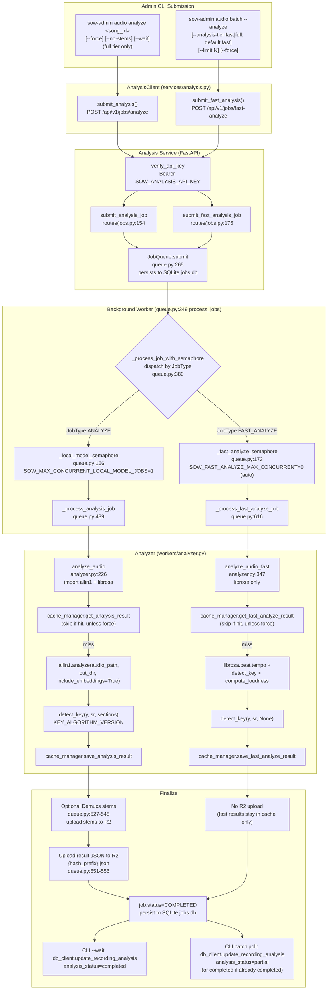

# Analyze Job Flow

## High-Level Summary

The Stream of Worship platform has **two analysis tiers**, both served by the Analysis Service (FastAPI in Docker) but reached through different Admin CLI commands and different HTTP endpoints:

1. **Full Analysis** (`audio analyze <song_id>`) — invokes `allin1.analyze()` for structural analysis (beats, downbeats, sections, embeddings) plus librosa-based key detection and (optional) Demucs stem separation. Heavy ML; runs in Docker because `allin1` depends on `natten` native libs that don't work on Apple Silicon macOS.

2. **Fast Analysis** (`audio batch --analyze [--analysis-tier fast]`) — librosa-only. Produces just the fast-tier subset: duration, tempo, key, mode, key confidence, loudness. No `allin1`, no beats/sections/embeddings, no stems. The default tier for `audio batch`.

**Key characteristics:**

- **Two distinct CLI entry points**: `audio analyze` (single recording, full tier only) vs `audio batch` (multi-recording, tier selectable via `--analysis-tier fast|full`, default `fast`).
- **Two distinct HTTP endpoints**: `POST /api/v1/jobs/analyze` (full) vs `POST /api/v1/jobs/fast-analyze` (fast). Both require Bearer auth via `SOW_ANALYSIS_API_KEY`.
- **Two distinct JobType values**: `ANALYZE` vs `FAST_ANALYZE` (`ops/analysis-service/src/sow_analysis/models.py:21-29`).
- **Two distinct concurrency semaphores** in the worker: `_local_model_semaphore` (allin1/demucs, default 1) vs `_fast_analyze_semaphore` (librosa-only, default cgroup-aware). They do not coordinate — operators size both together (`ops/analysis-service/src/sow_analysis/workers/queue.py:166-173`).
- **Two distinct caches**: full results at `{hash_prefix}.v{version}.json`, fast results at `{hash_prefix}_fast.v{version}.json`. Fast never overwrites full (`ops/analysis-service/src/sow_analysis/storage/cache.py:36, 95`).
- **Two distinct DB statuses on success**: `completed` (full) vs `partial` (fast). Recordings with `partial` can be later upgraded to `completed` by re-running with `--analysis-tier full`.
- **Persistence**: Job state in local SQLite (`{CACHE_DIR}/jobs.db`), full-tier results uploaded to Cloudflare R2 as `{hash_prefix}.json`, both tiers' results written back to Postgres by the CLI on completion.

## Mermaid Diagram



## Full Analysis Path

### CLI command — `audio analyze`

**File:** `ops/admin-cli/src/stream_of_worship/admin/commands/audio.py:1514`

```bash
sow-admin audio analyze <song_id> [--force/-f] [--no-stems] [--wait/-w] [--config/-c PATH]
```

The command (`analyze_recording`, audio.py:1514-1685):

1. Loads config → `AdminConfig.load(config_path)` (`config.py:75`) reads TOML at `~/.config/stream-of-worship-admin/config.toml` to get `analysis_url` (default `http://localhost:8000`, `config.py:34`).
2. Looks up recording via `db_client.get_recording_by_song_id(song_id)` → fetches `r2_audio_url` + `content_hash` (audio.py:1537).
3. Short-circuits if `analysis_status == "completed"` without `--force` (audio.py:1551), or if `"processing"` without `--wait` (audio.py:1559).
4. Builds `AnalysisClient(config.analysis_url)` — requires env var `SOW_ANALYSIS_API_KEY` (`services/analysis.py:149`).
5. Calls `client.submit_analysis(audio_url, content_hash, generate_stems=not no_stems, force=force)` (audio.py:1582).
6. Updates DB: `analysis_status="processing"`, `analysis_job_id=job_id` (audio.py:1598).
7. With `--wait`: polls `client.wait_for_completion(job_id, poll_interval=30, timeout=600)` (audio.py:1625), then `db_client.update_recording_analysis(...)` writes `tempo_bpm`, key/mode, beats, sections, etc. (audio.py:1651).

### HTTP submission — `AnalysisClient.submit_analysis`

**File:** `ops/admin-cli/src/stream_of_worship/admin/services/analysis.py:205-263`

```python
payload = {
    "audio_url": audio_url,
    "content_hash": content_hash,
    "options": {
        "generate_stems": generate_stems,
        "force": force,
    },
}
response = requests.post(
    f"{self.base_url}/api/v1/jobs/analyze",
    json=payload,
    headers=self._auth_headers(),  # {"Authorization": f"Bearer {self._api_key}"}
    timeout=self.timeout,
)
```

The HTTP request:

```
POST {analysis_url}/api/v1/jobs/analyze
Authorization: Bearer <SOW_ANALYSIS_API_KEY>
Content-Type: application/json

{
  "audio_url": "s3://stream-of-worship/<hash>/audio.mp3",
  "content_hash": "<sha256>",
  "options": {"generate_stems": true, "force": false}
}
```

Response is immediate: `JobResponse{job_id, status="queued", job_type="analyze"}`.

### Service endpoint — `POST /api/v1/jobs/analyze`

**File:** `ops/analysis-service/src/sow_analysis/routes/jobs.py:154-172`

```python
@router.post("/jobs/analyze", response_model=JobResponse)
async def submit_analysis_job(
    request: AnalyzeJobRequest,
    api_key: str = Depends(verify_api_key),
) -> JobResponse:
    if job_queue is None:
        raise HTTPException(500, "Job queue not initialized")
    job = await job_queue.submit(JobType.ANALYZE, request)
    return job_to_response(job)
```

### Worker dispatch — `_process_analysis_job`

**File:** `ops/analysis-service/src/sow_analysis/workers/queue.py:439-614`

The dispatcher (`_process_job_with_semaphore`, queue.py:380) acquires `_local_model_semaphore` for the entire job (queue.py:391), then calls `_process_analysis_job`:

1. Sets state `PROCESSING / downloading / 0.1`, persists to SQLite (queue.py:449-460).
2. Validates dependency availability — `analyze_audio` and `separate_stems` must be importable (queue.py:476-490).
3. Initializes R2 client if `SOW_R2_ENDPOINT_URL` set (queue.py:493-495).
4. Downloads audio from R2 into a `tempfile.TemporaryDirectory()` as `audio.mp3` (queue.py:500-509).
5. Sets stage `analyzing / 0.3` (queue.py:511-512).
6. Calls `analyze_audio(audio_path, cache_manager, content_hash, force=...)` (queue.py:516-521).
7. (Optional) If `generate_stems`, calls `separate_stems()` (Demucs), uploads stems to R2 (queue.py:527-548).
8. Uploads analysis result JSON to R2 as `{hash_prefix}.json` (queue.py:551-556).
9. Builds `JobResult` with all fields (queue.py:561-578), sets `COMPLETED / 1.0` (queue.py:580-582).
10. Persists completion to SQLite (queue.py:588-597).

### The `allin1.analyze()` invocation — `analyze_audio`

**File:** `ops/analysis-service/src/sow_analysis/workers/analyzer.py:226-344`

```python
async def analyze_audio(
    audio_path: Path,
    cache_manager: CacheManager,
    content_hash: str,
    *,
    force: bool = False,
) -> dict:
    import allin1

    # 1. Cache check (analyzer.py:254-259)
    if not force:
        cached = cache_manager.get_analysis_result(content_hash)
        if cached:
            return cached

    # 2. Load audio (analyzer.py:263-267)
    y, sr = librosa.load(str(audio_path), sr=None, mono=True)
    duration = librosa.get_duration(y=y, sr=sr)

    # 3. Run allin1.analyze() in thread pool — it's blocking (analyzer.py:277-286)
    loop = asyncio.get_event_loop()
    with tempfile.TemporaryDirectory() as temp_dir:
        def run_allin1():
            return allin1.analyze(
                str(audio_path),
                out_dir=temp_dir,
                visualize=False,
                include_embeddings=True,
                sonify=False,
            )
        result = await loop.run_in_executor(None, run_allin1)

    # 4. Extract allin1 results (analyzer.py:291-311)
    bpm = result.bpm
    beats = result.beats.tolist() if isinstance(result.beats, np.ndarray) else list(result.beats)
    downbeats = result.downbeats.tolist() if isinstance(result.downbeats, np.ndarray) else list(result.downbeats)
    sections = [
        {"label": seg.label, "start": seg.start, "end": seg.end}
        for seg in result.segments
    ]
    embeddings_shape = list(result.embeddings.shape)

    # 5. Key detection (analyzer.py:316) — Krumhansl-Schmuckler
    key_result = detect_key(y, sr, sections)

    # 6. Loudness (analyzer.py:324) — RMS-based dB
    loudness_db = compute_loudness(y)

    # 7. Build + cache result (analyzer.py:329-344)
    analysis_result = {
        "duration_seconds": duration,
        "tempo_bpm": bpm,
        **key_result.to_analysis_fields(),
        "loudness_db": loudness_db,
        "beats": beats,
        "downbeats": downbeats,
        "sections": sections,
        "embeddings_shape": embeddings_shape,
    }
    cache_manager.save_analysis_result(content_hash, analysis_result)
    return analysis_result
```

### Key detection algorithm selection

**File:** `ops/analysis-service/src/sow_analysis/workers/analyzer.py:200-208`

```python
def detect_key(y, sr, segments=None) -> KeyDetectionResult:
    algorithm = settings.KEY_ALGORITHM_VERSION
    if algorithm == "ks_fulltrack_v1":
        return detect_key_fulltrack(y, sr)
    if algorithm == "ks_segment_vote_v1":
        return detect_key_segment_vote(y, sr, segments, algorithm_version=algorithm)
    if algorithm == "ks_window_vote_v1":
        return detect_key_segment_vote(y, sr, None, algorithm_version=algorithm)
    raise ValueError(f"Unsupported KEY_ALGORITHM_VERSION: {algorithm}")
```

Default `KEY_ALGORITHM_VERSION = "ks_segment_vote_v1"` (`config.py:27`) — Krumhansl-Schmuckler voted per-section using the allin1 segments as analysis windows.

## Fast Analysis Path

### CLI command — `audio batch`

**File:** `ops/admin-cli/src/stream_of_worship/admin/commands/audio.py:4287`

```bash
sow-admin audio batch --analyze [--analysis-tier fast|full] [--limit N] [--force] \
    [--analysis-status incomplete] [--album NAME] [--song NAME] [--stdin] [--resume PATH]
```

The `--analysis-tier` flag (audio.py:4309-4311) defaults to `"fast"`. Validation at audio.py:4380-4384 rejects anything other than `"fast"` or `"full"`.

Submission branch (audio.py:5282-5294):

```python
if analysis_tier == "fast":
    job = analysis_client.submit_fast_analysis(
        audio_url=recording.r2_audio_url,
        content_hash=recording.content_hash,
        force=force,
    )
else:
    job = analysis_client.submit_analysis(
        audio_url=recording.r2_audio_url,
        content_hash=recording.content_hash,
        generate_stems=False,
        force=force,
    )
```

Skip logic (audio.py:5228-5242):
- Fast tier skips recordings with `analysis_status in ("partial", "completed")`.
- Full tier skips only recordings with `analysis_status == "completed"`.

In-flight job reuse (audio.py:5244-5278): if a recording is already `"processing"` and the existing job is not stale, the CLI reuses it — but only if the existing job's tier matches the requested tier (audio.py:5254: `existing_job.job_type == "fast_analyze"`).

### HTTP submission — `AnalysisClient.submit_fast_analysis`

**File:** `ops/admin-cli/src/stream_of_worship/admin/services/analysis.py:265-330`

```python
payload = {
    "audio_url": audio_url,
    "content_hash": content_hash,
    "options": {
        "force": force,
        "sample_rate": sample_rate,  # default 22050
        "hop_length": hop_length,    # default 4096
    },
}
response = requests.post(
    f"{self.base_url}/api/v1/jobs/fast-analyze",
    json=payload,
    headers=self._auth_headers(),
    timeout=self.timeout,
)
```

The HTTP request:

```
POST {analysis_url}/api/v1/jobs/fast-analyze
Authorization: Bearer <SOW_ANALYSIS_API_KEY>
Content-Type: application/json

{
  "audio_url": "s3://stream-of-worship/<hash>/audio.mp3",
  "content_hash": "<sha256>",
  "options": {"force": false, "sample_rate": 22050, "hop_length": 4096}
}
```

### Service endpoint — `POST /api/v1/jobs/fast-analyze`

**File:** `ops/analysis-service/src/sow_analysis/routes/jobs.py:175-197`

```python
@router.post("/jobs/fast-analyze", response_model=JobResponse)
async def submit_fast_analysis_job(
    request: FastAnalyzeJobRequest,
    api_key: str = Depends(verify_api_key),
) -> JobResponse:
    """Submit audio for fast analysis (librosa-only).

    Produces only the fast-tier subset: duration, tempo, key, mode, key
    confidence, loudness. Full-only fields (beats, sections, embeddings,
    stems) are absent on the result.
    """
    if job_queue is None:
        raise HTTPException(500, "Job queue not initialized")
    job = await job_queue.submit(JobType.FAST_ANALYZE, request)
    return job_to_response(job)
```

### Worker dispatch — `_process_fast_analyze_job`

**File:** `ops/analysis-service/src/sow_analysis/workers/queue.py:616-763`

The dispatcher (`_process_job_with_semaphore`, queue.py:409-418) acquires `_fast_analyze_semaphore` (separate from `_local_model_semaphore`), re-checks cancellation after acquiring, then calls `_process_fast_analyze_job`:

1. Sets state `PROCESSING / downloading / 0.1`, persists to SQLite (queue.py:630-640).
2. Validates `analyze_audio_fast` is importable (queue.py:656-670).
3. Initializes R2 client; raises `RuntimeError` if R2 not configured (queue.py:674-680).
4. Downloads audio from R2 into tempdir, guards against truncated downloads (queue.py:684-696).
5. Sets stage `analyzing / 0.3` (queue.py:698-705).
6. Calls `analyze_audio_fast(audio_path, cache_manager, content_hash, sample_rate=..., hop_length=..., force=...)` (queue.py:707-714).
7. Builds `JobResult` with **fast subset only** — `beats`, `downbeats`, `sections`, `embeddings_shape`, `stems_url` stay `None` (queue.py:716-729).
8. Sets `COMPLETED / 1.0`, persists to SQLite (queue.py:731-747).
9. **Does NOT upload to R2** — fast results stay in the local cache only (no `{hash_prefix}.json` write).

### The librosa-only analyzer — `analyze_audio_fast`

**File:** `ops/analysis-service/src/sow_analysis/workers/analyzer.py:347-440`

```python
async def analyze_audio_fast(
    audio_path: Path,
    cache_manager: CacheManager,
    content_hash: str,
    sample_rate: int = 22050,
    hop_length: int = 4096,
    force: bool = False,
) -> dict:
    # 1. Cache check (analyzer.py:377-381) — distinct from full-tier cache
    if not force:
        cached = cache_manager.get_fast_analyze_result(content_hash)
        if cached:
            return cached

    loop = asyncio.get_event_loop()

    # 2. Load audio (analyzer.py:389-394)
    def _load_audio():
        y, sr = librosa.load(str(audio_path), sr=sample_rate, mono=True)
        duration = librosa.get_duration(y=y, sr=sr)
        return y, sr, duration
    y, sr, duration = await loop.run_in_executor(None, _load_audio)

    # 3. Tempo via librosa.beat.tempo (analyzer.py:402-409)
    def _compute_tempo() -> float:
        onset_env = librosa.onset.onset_strength(y=y, sr=sr, hop_length=hop_length)
        tempo = librosa.beat.tempo(onset_envelope=onset_env, sr=sr, hop_length=hop_length)
        if hasattr(tempo, "__iter__"):
            tempo = float(tempo[0])
        return float(tempo)
    bpm = await loop.run_in_executor(None, _compute_tempo)

    # 4. Key detection (analyzer.py:416) — segments=None (no allin1 sections available)
    key_result = await loop.run_in_executor(None, detect_key, y, sr, None)

    # 5. Loudness (analyzer.py:424)
    loudness_db = await loop.run_in_executor(None, compute_loudness, y)

    # 6. Build + cache result (analyzer.py:430-438)
    analysis_result = {
        "duration_seconds": duration,
        "tempo_bpm": bpm,
        **key_result.to_analysis_fields(),
        "loudness_db": loudness_db,
    }
    cache_manager.save_fast_analyze_result(content_hash, analysis_result)
    return analysis_result
```

Note: `detect_key` is called with `segments=None` for fast tier. With the default `KEY_ALGORITHM_VERSION = "ks_segment_vote_v1"`, this routes to `detect_key_segment_vote(y, sr, None, ...)` which falls back to fixed-window voting rather than per-section voting (analyzer.py:206-207).

## Endpoints & Auth

Both endpoints use the same `verify_api_key` dependency:

**File:** `ops/analysis-service/src/sow_analysis/routes/jobs.py:40-63`

```python
async def verify_api_key(authorization: Optional[str] = Header(None)) -> str:
    if not authorization or not authorization.startswith("Bearer "):
        raise HTTPException(401, "Missing or invalid Authorization header")
    token = authorization[7:]
    if not settings.SOW_ANALYSIS_API_KEY:
        raise HTTPException(500, "SOW_ANALYSIS_API_KEY not configured on server")
    if token != settings.SOW_ANALYSIS_API_KEY:
        raise HTTPException(401, "Invalid API key")
    return token
```

The CLI reads the same key from env (`services/analysis.py:149`) and sends it as `Authorization: Bearer <key>`. There is no per-tier auth — both endpoints accept the same `SOW_ANALYSIS_API_KEY`.

## Job Models

**File:** `ops/analysis-service/src/sow_analysis/models.py:21-67`

```python
class JobType(str, Enum):
    ANALYZE = "analyze"
    LRC = "lrc"
    STEM_SEPARATION = "stem_separation"
    EMBEDDING = "embedding"
    FORCED_ALIGNMENT = "forced_alignment"
    FAST_ANALYZE = "fast_analyze"


class AnalyzeOptions(BaseModel):
    generate_stems: bool = True
    stem_model: str = "htdemucs"
    force: bool = False


class AnalyzeJobRequest(BaseModel):
    audio_url: str
    content_hash: str
    options: AnalyzeOptions = Field(default_factory=AnalyzeOptions)


class FastAnalyzeOptions(BaseModel):
    force: bool = False
    sample_rate: int = 22050
    hop_length: int = 4096


class FastAnalyzeJobRequest(BaseModel):
    audio_url: str
    content_hash: str
    options: FastAnalyzeOptions = Field(default_factory=FastAnalyzeOptions)
```

## Queue Semaphore Isolation

**File:** `ops/analysis-service/src/sow_analysis/workers/queue.py:164-173`

```python
# Global semaphore for local model execution (Whisper, Qwen3, audio-separator, allin1, demucs)
self._local_model_semaphore = asyncio.Semaphore(max_concurrent_local_model)
# ...
# Separate semaphore for fast analysis (librosa-only, CPU/memory heavy).
# Distinct from _local_model_semaphore (allin1/demucs) so fast and full
# analysis do not coordinate; operator sizes both together.
self._fast_analyze_semaphore = asyncio.Semaphore(settings.SOW_FAST_ANALYZE_MAX_CONCURRENT)
```

Dispatch (`_process_job_with_semaphore`, queue.py:380-418):

```python
if job.type == JobType.ANALYZE:
    # Analysis always uses local models (allin1, demucs) - acquire semaphore for entire job
    async with self._local_model_semaphore:
        await self._process_analysis_job(job)
# ...
elif job.type == JobType.FAST_ANALYZE:
    # Fast analysis (librosa-only) uses its own semaphore, distinct from
    # _local_model_semaphore (allin1/demucs) so the two do not coordinate.
    async with self._fast_analyze_semaphore:
        latest = self._jobs.get(job.id, job)
        if latest.status == JobStatus.CANCELLED:
            return
        await self._process_fast_analyze_job(job)
```

The two semaphores are intentionally independent — a running full analysis does not block a fast analysis from starting (and vice versa). Operators must size both together when capacity planning.

## Cache Strategy

**File:** `ops/analysis-service/src/sow_analysis/storage/cache.py`

Two separate cache namespaces, both keyed by `content_hash` and versioned by `KEY_ALGORITHM_VERSION`:

| Method | File | Cache file pattern |
|---|---|---|
| `get_analysis_result` / `save_analysis_result` | cache.py:36, 80 | `{hash_prefix}.v{KEY_ALGORITHM_VERSION}.json` (legacy: `{hash_prefix}.json`) |
| `get_fast_analyze_result` / `save_fast_analyze_result` | cache.py:95, 130 | `{hash_prefix}_fast.v{KEY_ALGORITHM_VERSION}.json` (legacy: `{hash_prefix}_fast.json`) |

Fast results are saved atomically via `NamedTemporaryFile` + `os.replace` (cache.py:145-154) so a mid-write reader sees either the old or new file, never a partial.

The `force` flag (passed through from `--force`) bypasses the cache check at the analyzer level (analyzer.py:255, 377). It does NOT delete the existing cache entry — it just re-runs the analysis and overwrites on save.

## Persistence

### SQLite job store

**File:** `ops/analysis-service/src/sow_analysis/workers/queue.py:178-180`

```python
db_path = db_path if db_path is not None else cache_dir / "jobs.db"
self.job_store = JobStore(db_path)
```

Both tiers persist job state (status, stage, progress, result_json, error_message) to `{CACHE_DIR}/jobs.db`. On service restart, interrupted `PROCESSING` jobs are recovered as `QUEUED` (queue.py:226-246).

### R2 result upload

| Tier | Uploads to R2? | Path |
|---|---|---|
| Full | Yes | `{hash_prefix}.json` (queue.py:551-556) |
| Fast | No | Stays in local cache only |

This is intentional: fast results are considered transient and may be superseded by a later full analysis. Full results are the canonical artifact and are uploaded for downstream use (e.g., by the LRC job's stem resolution, or by the webapp).

### Postgres writeback

The CLI writes results back to the `recordings` table on job completion:

**Full tier** (`audio analyze --wait`, audio.py:1651-1675): writes all fields including `beats`, `downbeats`, `sections`, `embeddings_shape`, `r2_stems_url`. Sets `analysis_status="completed"`.

**Fast tier** (`audio batch` poll loop, audio.py:5847-5889): writes only the fast subset. Sets `analysis_status="partial"` — unless the recording was already `"completed"`, in which case it stays `"completed"` (audio.py:5850-5851). Full-only fields (`beats`, `downbeats`, `sections`, `embeddings_shape`) are explicitly set to `None` for fast tier (audio.py:5869-5886) so a re-run after `--force` doesn't leave stale full-tier data behind.

## Config & Env Vars

### Admin CLI side

| Setting | File | Line | Default |
|---|---|---|---|
| `AdminConfig.analysis_url` | `ops/admin-cli/src/stream_of_worship/admin/config.py` | 34 | `http://localhost:8000` |
| `SOW_ANALYSIS_API_KEY` (env) | `ops/admin-cli/src/stream_of_worship/admin/services/analysis.py` | 149 | — (required) |
| `SOW_ADMIN_API_KEY` (env) | `ops/admin-cli/src/stream_of_worship/admin/services/analysis.py` | 156 | — (optional, for cancel ops) |
| `SOW_DATABASE_PASSWORD` (env) | `ops/admin-cli/src/stream_of_worship/admin/config.py` | 65 | — (required for DB) |
| Config file path | `ops/admin-cli/src/stream_of_worship/admin/config.py` | 87-88 | `~/.config/stream-of-worship-admin/config.toml` |

### Analysis Service side

| Setting | File | Line | Default |
|---|---|---|---|
| `SOW_R2_BUCKET` | `ops/analysis-service/src/sow_analysis/config.py` | 16 | `sow-audio` |
| `SOW_R2_ENDPOINT_URL` | same | 17 | `""` |
| `SOW_ANALYSIS_API_KEY` | same | 22 | `""` |
| `SOW_ADMIN_API_KEY` | same | 23 | `""` |
| `CACHE_DIR` | same | 26 | `/cache` |
| `KEY_ALGORITHM_VERSION` | same | 27 | `ks_segment_vote_v1` |
| `SOW_MAX_CONCURRENT_LOCAL_MODEL_JOBS` | same | 28 | `1` (allin1/demucs) |
| `SOW_FAST_ANALYZE_MAX_CONCURRENT` | same | 35 | `0` (auto: cgroup-aware, capped at 4) |
| `SOW_DEMUCS_MODEL` | same | 59 | `htdemucs` |
| `SOW_DEMUCS_DEVICE` | same | 60 | `cpu` |

The `SOW_FAST_ANALYZE_MAX_CONCURRENT` validator (config.py:37-48) auto-computes when `<=0`: on Linux uses `min(4, max(1, len(os.sched_getaffinity(0)) // 2))`, on macOS falls back to `1`.

## Quick Reference Table

| Aspect | Full Analysis | Fast Analysis |
|---|---|---|
| CLI command | `sow-admin audio analyze <song_id>` | `sow-admin audio batch --analyze [--analysis-tier fast]` |
| CLI flags | `--force`, `--no-stems`, `--wait`, `--config` | `--analysis-tier fast` (default), `--force`, `--limit`, `--analysis-status`, `--album`, `--song`, `--stdin`, `--resume` |
| HTTP endpoint | `POST /api/v1/jobs/analyze` | `POST /api/v1/jobs/fast-analyze` |
| JobType | `ANALYZE` (`"analyze"`) | `FAST_ANALYZE` (`"fast_analyze"`) |
| Request model | `AnalyzeJobRequest` / `AnalyzeOptions` | `FastAnalyzeJobRequest` / `FastAnalyzeOptions` |
| Concurrency semaphore | `_local_model_semaphore` | `_fast_analyze_semaphore` |
| Concurrency config | `SOW_MAX_CONCURRENT_LOCAL_MODEL_JOBS` (default 1) | `SOW_FAST_ANALYZE_MAX_CONCURRENT` (default auto) |
| Analyzer function | `analyze_audio` (analyzer.py:226) | `analyze_audio_fast` (analyzer.py:347) |
| ML libraries | `allin1` + `librosa` + `demucs` (optional) | `librosa` only |
| Output fields | duration, tempo, key/mode/confidence, loudness, **beats, downbeats, sections, embeddings_shape**, optional stems_url | duration, tempo, key/mode/confidence, loudness only |
| Cache file | `{hash_prefix}.v{version}.json` | `{hash_prefix}_fast.v{version}.json` |
| R2 upload | Yes (`{hash_prefix}.json`) | No |
| DB status on success | `completed` | `partial` (or stays `completed` if already completed) |
| CLI `--wait` support | Yes (single recording) | No (batch uses its own poll loop) |
| Key detection | `detect_key(y, sr, sections)` — per-section vote | `detect_key(y, sr, None)` — fixed-window vote |
| Typical use case | Single-song deep analysis with structural detail | Bulk library classification (BPM/key for hundreds of songs) |

## Prerequisites to Run

1. **Start the Analysis Service in Docker** (only way to run `allin1` on macOS due to `natten` native libs):
   ```bash
   cd ops/analysis-service && docker compose up -d
   ```
   Serves on `http://localhost:8000`.

2. **Set the API key** on both sides:
   ```bash
   export SOW_ANALYSIS_API_KEY=<shared-secret>
   ```
   The service reads it from env (`config.py:22`); the CLI reads it from env (`services/analysis.py:149`).

3. **Configure the CLI** (if not using the default `http://localhost:8000`):
   ```bash
   sow-admin db init   # creates ~/.config/stream-of-worship-admin/config.toml
   # Edit [service] analysis_url and [database] url as needed
   ```

4. **Recording must exist** in Postgres with `r2_audio_url` and `content_hash` (e.g., from `sow-admin audio download <song_id>`).

5. **Run the analysis**:
   ```bash
   # Full (single song, blocking)
   sow-admin audio analyze <song_id> --wait

   # Fast (bulk, default tier)
   sow-admin audio batch --analysis-status incomplete --analyze --limit 500

   # Fast (explicit)
   sow-admin audio batch --analyze --analysis-tier fast

   # Full (bulk)
   sow-admin audio batch --analyze --analysis-tier full
   ```

## Open Questions / Known Gaps

1. **`audio analyze` has no `--tier fast` flag.** The single-recording command always submits a full analysis. The spec `specs/scale-key-bpm-analysis-batch.md:980` planned `analyze --tier fast <song_id>` but it was never implemented — `--analysis-tier` only shipped on `audio batch`. If you want fast analysis of a single song, you must either use `audio batch` with a filter that narrows to that song, hit the HTTP endpoint directly with `curl`, or add a new flag.

2. **Webapp and Android never trigger fast analysis.** Fast is strictly an admin/batch-side concept. The webapp and Android client only ever submit full `ANALYZE` jobs (or LRC/embedding jobs). There is no UI surface for fast analysis in the user-facing apps.

3. **Fast results are not uploaded to R2.** This means a fast-analyzed recording's results live only in the Analysis Service's local cache and in Postgres. If the cache is cleared, the fast result is lost (though the Postgres row still has the fast-tier fields). A subsequent `audio analyze <song_id> --wait` (full) will recompute and upload to R2.

4. **Cache key versioning is shared.** Both fast and full caches are versioned by the same `KEY_ALGORITHM_VERSION` setting. Bumping `KEY_ALGORITHM_VERSION` invalidates both caches simultaneously. There is no way to invalidate just one tier's cache without also invalidating the other (short of manually deleting cache files).

5. **No automatic fast→full upgrade path.** A recording with `analysis_status="partial"` (fast-done) is not automatically upgraded to full. Operators must explicitly run `audio batch --analyze --analysis-tier full --analysis-status partial` (or `audio analyze <song_id> --force`) to upgrade.
