# LRC Job Flow

## High-Level Summary

The LRC (Lyric) job generates timestamped lyric files (`.lrc`) for songs in the Stream of Worship platform. It orchestrates a multi-stage pipeline that attempts three transcription strategies in priority order, with automatic fallback between them.

**The transcription priority is:**

1. **YouTube Transcript** (preferred) — When a YouTube URL is provided, the system fetches human-curated or auto-generated captions, uses an LLM to correct them against official lyrics, and produces LRC directly. No audio download or stem separation is needed for this path.

2. **Whisper ASR** (fallback) — When no YouTube URL is provided or the YouTube path fails, the system downloads audio from R2, optionally extracts vocals stems for cleaner transcription, runs local Whisper (`faster_whisper`) to produce phrase-level transcriptions with timestamps, then uses an LLM to align the official lyrics with Whisper's output.

3. **Qwen3 Refinement** (optional post-processing) — After either path produces timestamps, an optional Qwen3 ForcedAligner can refine the timestamps for higher precision. This runs in-process within the analysis service, not as a separate Docker container. It never replaces the primary transcription method.

**Key characteristics:**

- **Two independent caches**: LRC results are cached by `(audio_hash, lyrics_hash)`; Whisper transcriptions are cached by `audio_hash` alone (so the same audio can get different LRCs if lyrics change).
- **Auto stem separation**: If `use_vocals_stem=true` and clean vocals aren't available, the LRC job auto-submits a child `STEM_SEPARATION` job and blocks (up to 2 hours) while waiting for it.
- **Cloud vs local models**: YouTube transcript fetching and LLM alignment use cloud APIs (OpenRouter, etc.). Whisper transcription and Qwen3 forced alignment use local models (GPU/CPU). A global semaphore limits concurrent local model execution to 1.
- **Persistence**: Job state is stored in local SQLite (`jobs.db`), results are uploaded to Cloudflare R2, and both LRC results and Whisper transcriptions are cached on disk.

## Mermaid Diagram

```mermaid
flowchart TD
    subgraph Submit["Admin CLI Submission"]
        A["POST /api/v1/jobs/lrc<br/>audio_url, content_hash,<br/>lyrics_text, youtube_url"] --> B["Job created: QUEUED"]
    end

    subgraph Queue["Job Queue Processing"]
        B --> C{"Cache hit?<br/>(audio_hash + lyrics_hash)"}
        C -->|Yes| D["Return cached LRC<br/>status=COMPLETED, stage=cached"]
        C -->|No| E["status=PROCESSING"]
    end

    subgraph Path1["Path 1: YouTube Transcript (Primary)"]
        E --> F{"youtube_url provided?"}
        F -->|Yes| G["Fetch YouTube captions<br/>(direct + list fallback)"]
        G --> H{"Transcript found?"}
        H -->|No| I["Fall through to Whisper path"]
        H -->|Yes| J["LLM correct transcript<br/>against official lyrics"]
        J --> K{"LLM correction succeeded?"}
        K -->|No| I
        K -->|Yes| L["Write LRC<br/>lrc_source=youtube_transcript"]
    end

    subgraph Path2["Path 2: Whisper ASR (Fallback)"]
        I --> M["Download audio from R2"]
        M --> N{"use_vocals_stem?"}
        N -->|Yes| O{"vocals_dry.flac exists in R2?"}
        N -->|No| P["Use full mix audio"]
        O -->|Yes| Q["Download vocals stem<br/>for transcription"]
        O -->|No| R["Auto-submit child<br/>STEM_SEPARATION job"]
        R --> S["Poll child job<br/>(max 2 hours)"]
        S --> T{"Child completed?"}
        T -->|Yes| Q
        T -->|No/Failed| P
        Q --> U{"Whisper cache hit?<br/>(audio_hash only)"}
        U -->|Yes| V["Use cached phrases"]
        U -->|No| W["Run Whisper transcription<br/>faster_whisper large-v3<br/>beam_size=5, vad_filter=true"]
        W --> X["Cache Whisper phrases"]
        X --> V2["Use phrases"]
        V2 --> Y["LLM align lyrics<br/>with Whisper timestamps"]
        Y --> Z["Write LRC<br/>lrc_source=whisper_asr"]
        P --> W
    end

    subgraph Path3["Path 3: Qwen3 Refinement (Optional)"]
        L --> AA{"use_qwen3?<br/>duration <= 300s?"}
        Z --> AA
        AA -->|Yes| AB["Call Qwen3 ForcedAligner<br/>in-process"]
        AA -->|No| AC["Skip refinement"]
        AB --> AD{"Qwen3 succeeded?"}
        AD -->|Yes| AE["Replace timestamps<br/>with Qwen3-aligned"]
        AD -->|No| AF["Keep LLM-aligned timestamps<br/>graceful fallback"]
    end

    subgraph Finalize["Finalize"]
        AE --> AG["Upload LRC to R2<br/>{hash_prefix}/lyrics.lrc"]
        AF --> AG
        AC --> AG
        AG --> AH["Save to disk cache<br/>(audio_hash + lyrics_hash)"]
        AH --> AI["status=COMPLETED<br/>stage=complete"]
    end

    subgraph AdminRetrieval["Admin CLI Retrieval"]
        AI --> AJ["Poll GET /api/v1/jobs/{id}<br/>or async sync"]
        AJ --> AK["Update catalog:<br/>r2_lrc_url, lrc_status=completed"]
    end

    style Submit fill:#e1f5fe
    style Queue fill:#f3e5f5
    style Path1 fill:#e8f5e9
    style Path2 fill:#fff3e0
    style Path3 fill:#fce4ec
    style Finalize fill:#e0f2f1
    style AdminRetrieval fill:#fce4ec
```



## Detailed Flow

### Phase 1: Job Submission

The Admin CLI submits an LRC job via `POST /api/v1/jobs/lrc` with:

| Field | Description |
|-------|-------------|
| `audio_url` | R2/S3 URL of the audio file |
| `content_hash` | SHA-256 hash of the audio content |
| `lyrics_text` | Official lyrics (newline-separated) |
| `youtube_url` | Optional YouTube URL for transcript-based LRC |
| `options.whisper_model` | Whisper model size (default: `large-v3`) |
| `options.language` | Whisper language hint (default: `zh`) |
| `options.use_vocals_stem` | Prefer vocals stem for transcription (default: `true`) |
| `options.use_qwen3` | Use Qwen3 for timestamp refinement (deprecated — use forced alignment job instead) |
| `options.force` | Re-generate even if cached (default: `false`) |
| `options.force_whisper` | Bypass Whisper transcription cache (default: `false`) |
| `options.max_qwen3_duration` | Max audio duration for Qwen3 in seconds (deprecated — use forced alignment job instead) |

### Phase 2: Cache Check

Before processing, the system computes a composite cache key:

```
lyrics_hash = SHA256(lyrics_text)[:16]
cache_key = SHA256(content_hash + lyrics_hash)[:32]
```

If a cached LRC result exists (and `force=false`), the job returns immediately with `stage=cached`.

**Note**: The cache key includes both audio hash AND lyrics hash. If lyrics change, a new LRC is generated.

Whisper transcriptions have a separate cache keyed only on `audio_hash`, so the same audio can produce different LRCs if lyrics differ.

### Phase 3: YouTube Transcript Path (Primary)

When `youtube_url` is provided:

1. **Extract video ID** from the YouTube URL (supports `youtube.com/watch` and `youtu.be` formats)
2. **Fetch transcript** via `youtube-transcript-api`:
   - Phase 1: Direct fetch with preferred language codes (`zh-Hant`, `zh-TW`, `zh-Hans`, `zh-CN`, `zh-HK`, `zh`, `en-US`, `en`)
   - Phase 2: List all available transcripts and pick the best one (manually created Chinese > generated Chinese > manually created English > generated English)
   - Supports rotating proxy configuration via `SOW_YOUTUBE_PROXY`
3. **LLM correction**: Send transcript + official lyrics to LLM (OpenRouter/OpenAI-compatible API) to correct each transcribed line to the matching official lyric while preserving timecodes
4. **Parse LRC**: Extract `[mm:ss.xx] text` lines from LLM response
5. **Write LRC** and set `lrc_source="youtube_transcript"`

If any step fails, the system falls through to the Whisper path.

### Phase 4: Whisper Path (Fallback)

When no YouTube URL is provided or the YouTube path fails:

#### 4a. Audio Download

Download audio from R2 to a temporary directory.

#### 4b. Vocals Stem Handling

If `use_vocals_stem=true`:

1. Check for `vocals_dry.flac` (or legacy `vocals_clean.flac`) in R2 via `get_vocals_dry_url()`
2. If found: download the vocals stem and use it for transcription instead of the full mix
3. If NOT found: auto-submit a child `STEM_SEPARATION` job and poll for completion (up to 2 hours)
   - If child completes: use its `vocals_dry_url` or `vocals_url`
   - If child fails or times out: fall back to full mix audio

#### 4c. Whisper Transcription

1. Check Whisper cache (keyed on `content_hash` only)
2. If cache miss (or `force_whisper=true`): run `faster_whisper` with:
   - Model: configurable (default `large-v3`)
   - Device: from `SOW_WHISPER_DEVICE` (default: `cpu`)
   - Beam size: 5, VAD filter: true
   - Initial prompt: includes truncated lyrics for Chinese worship context
3. Semaphore-controlled: acquires `_local_model_semaphore` to limit concurrent local model execution
4. Cache the transcription phrases for future use

#### 4d. LLM Alignment

1. Build alignment prompt with official lyrics + Whisper phrases (JSON with timestamps)
2. Call LLM (OpenRouter/OpenAI-compatible API, e.g., `openai/gpt-4o-mini`) to map each Whisper phrase to the correct lyric line
3. Retry up to 3 times on parse/validation failures
4. Post-alignment validation: check coverage (duration gap, line count ratio)
5. **Not semaphore-controlled**: uses cloud API, not a local model

#### 4e. Qwen3 Refinement (Optional)

If `use_qwen3=true` and `content_hash` is provided and audio duration <= `max_qwen3_duration` (default 300s):

1. Call in-process Qwen3 ForcedAligner (configured via `SOW_FORCED_ALIGNER_MODEL_PATH`)
2. Uses clean vocals stem if available, otherwise full mix
3. Semaphore-controlled: acquires `_local_model_semaphore`
4. **Graceful fallback**: any exception (connection error, timeout, general) keeps the LLM-aligned timestamps

### Phase 5: Finalize

1. **Upload LRC to R2**: stored at `{hash_prefix}/lyrics.lrc` where `hash_prefix = content_hash[:12]`
2. **Save to disk cache**: keyed by composite hash `(audio_hash + lyrics_hash)`
3. **Update job status**: `COMPLETED`, `stage=complete`, `progress=1.0`
4. **Persist to SQLite**: job store updated with `result_json` containing `{lrc_url, line_count, lrc_source}`
5. **Cleanup**: finished job removed from in-memory cache after 5 minutes

### Phase 6: Admin CLI Retrieval

Two mechanisms for the Admin CLI to retrieve results:

**Mechanism 1: Synchronous wait** (`--wait` flag)
- Poll `GET /api/v1/jobs/{job_id}` every 30 seconds
- When `status=completed`, update catalog with `r2_lrc_url` and `lrc_status=completed`

**Mechanism 2: Async sync** (`sow-admin audio status --sync`)
- Iterate over recordings with `lrc_status IN ('pending', 'processing')`
- Query Analysis Service API for each job's status
- Update catalog on completion or mark as failed

## Job Stages

The `stage` field tracks progress through the pipeline:

| Stage | Description |
|-------|-------------|
| `starting` | Job begins processing |
| `trying_youtube_transcript` | Attempting YouTube transcript path |
| `youtube_transcript_done` | YouTube path succeeded |
| `downloading` | Downloading audio from R2 |
| `using_vocals_stem` | Using vocals stem for transcription |
| `submitting_stem_separation_child` | Auto-submitting child stem separation job |
| `awaiting_stem_separation:{child_id}` | Polling for child job completion |
| `using_vocals_dry_stem` | Using dry vocals from child job |
| `transcription_cached` | Using cached Whisper transcription |
| `transcribing` | Running Whisper transcription |
| `uploading` | Uploading LRC to R2 |
| `cached` | Returned from cache (no processing) |
| `complete` | Job completed successfully |
| `lrc_error` | LRC worker error |
| `error` | Unexpected error |
| `cancelled` | Job was cancelled |

## Caching Strategy

### LRC Result Cache

- **Key**: `SHA256(content_hash + SHA256(lyrics_text)[:16])[:32]`
- **Storage**: `{cache_dir}/{hash_prefix}_lrc.json`
- **Content**: `{lrc_url, line_count}`
- **Invalidation**: Changes to either audio or lyrics invalidate the cache

### Whisper Transcription Cache

- **Key**: `content_hash[:32]` (audio hash only)
- **Storage**: `{cache_dir}/{hash_prefix}_whisper.json`
- **Content**: `{phrases: [{text, start, end}], cached_at}`
- **Invalidation**: Only audio changes invalidate; lyrics changes do NOT
- **Bypass**: `force_whisper=true` option

### Job Database

- **Storage**: `{cache_dir}/jobs.db` (SQLite via `aiosqlite`)
- **Purpose**: Persistent job state, recovery of interrupted jobs, history
- **Cleanup**: Old completed/failed jobs purged after 7 days

## Concurrency Control

| Resource | Limit | Controlled By |
|----------|-------|---------------|
| Local models (Whisper, Qwen3, audio-separator, allin1, demucs) | 1 concurrent | `_local_model_semaphore` |
| Embedding jobs (cloud API) | 5 concurrent | `_embedding_semaphore` |
| Analysis jobs | Serialized (via local model semaphore) | Same semaphore |
| LRC jobs | Whisper/Qwen3 steps serialized; YouTube/LLM steps concurrent | Semaphore only for local model steps |

## Error Handling

| Error | Handling |
|-------|----------|
| YouTube transcript not found | Fall through to Whisper path |
| YouTube LLM correction fails | Fall through to Whisper path |
| Child stem separation fails | Fall back to full mix audio |
| Stem separation timeout (2h) | Fall back to full mix audio |
| Whisper transcription fails | Job fails with `WhisperTranscriptionError` |
| LLM alignment fails (3 retries) | Job fails with `LLMAlignmentError` |
| Qwen3 refinement fails | Keep LLM-aligned timestamps (non-blocking) |
| R2 upload fails | Job fails with error message |
| Service crash during processing | Job recovered on restart (requeued) |

## Environment Variables

| Variable | Required | Default | Description |
|----------|----------|---------|-------------|
| `SOW_LLM_API_KEY` | For LLM steps | — | OpenRouter/OpenAI API key |
| `SOW_LLM_BASE_URL` | For LLM steps | — | e.g., `https://openrouter.ai/api/v1` |
| `SOW_LLM_MODEL` | For LLM steps | — | e.g., `openai/gpt-4o-mini` |
| `SOW_WHISPER_DEVICE` | No | `cpu` | Whisper device (`cpu` or `cuda`) |
| `SOW_WHISPER_CACHE_DIR` | No | `/cache/whisper` | Whisper model cache directory |
| `SOW_FORCED_ALIGNER_MODEL_PATH` | No | `Qwen/Qwen3-ForcedAligner-0.6B` | Forced aligner model path (HF ID or local) |
| `SOW_FORCED_ALIGNER_DEVICE` | No | `auto` | Device for forced alignment (auto/mps/cuda/cpu) |
| `SOW_YOUTUBE_PROXY` | No | — | Proxy for YouTube transcript requests |
| `SOW_YOUTUBE_PROXY_RETRIES` | No | `3` | Retries on HTTP 429 for proxy |
| `SOW_MAX_CONCURRENT_LOCAL_MODEL_JOBS` | No | `1` | Max concurrent local model executions |

## Model Roles Summary

| Model | Role | Location | API Type |
|-------|------|----------|----------|
| YouTube captions | Human-curated subtitles | External (YouTube) | `youtube-transcript-api` |
| Whisper (`faster_whisper`) | ASR transcription | Local (GPU/CPU) | Local model |
| LLM (GPT-4o-mini, etc.) | Text correction (YouTube) / Timestamp alignment (Whisper) | Cloud API (OpenRouter, etc.) | OpenAI-compatible |
| Qwen3 ForcedAligner | Timestamp precision refinement | In-process model | Direct model call |
