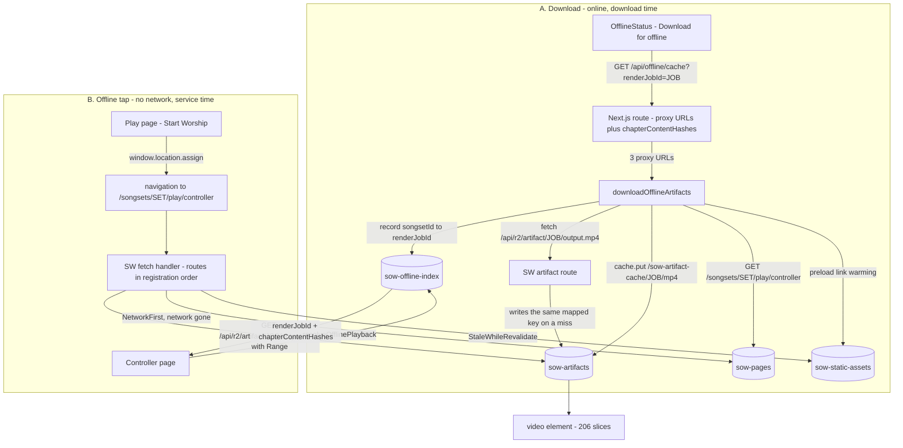
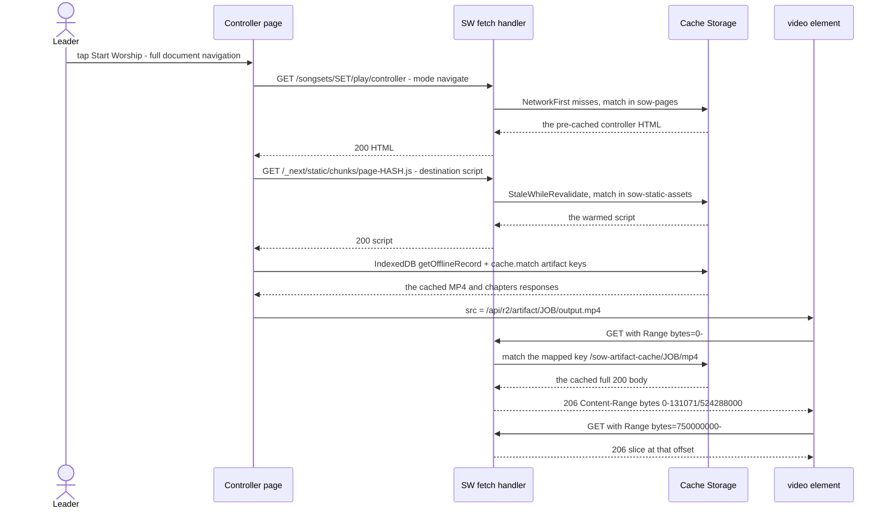
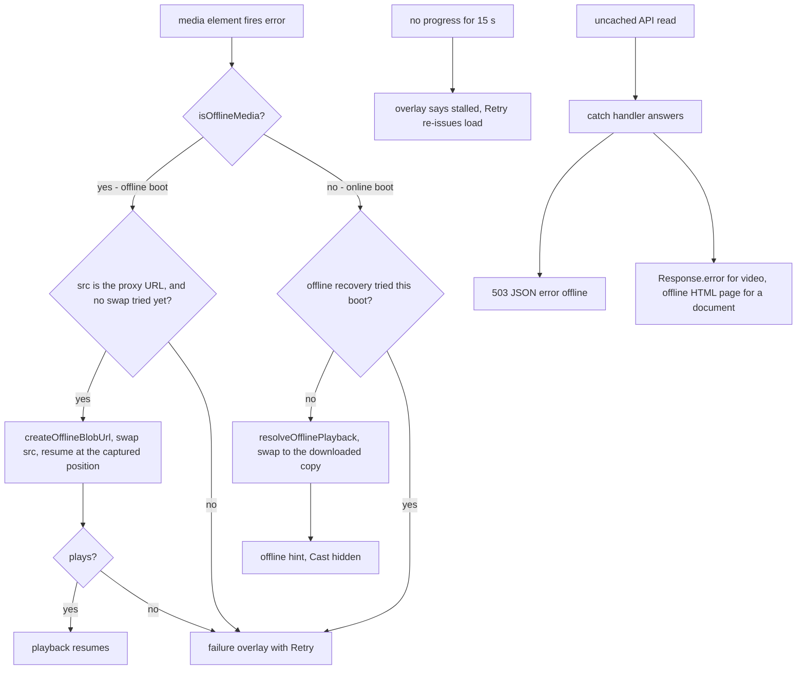

# Offline Worship Playback — Design Explained

*Who this is for:* a web developer who needs to understand, debug, or change the offline path of the Stream of Worship web app — and who has never written a service worker.
*What it assumes:* you can read TypeScript, React, and HTTP. It does **not** assume you know what a service worker is; §2 is a primer.
*How to read it:* §4 and §5 are the two walkthroughs (the download, then the offline tap); §8 is the list of rules that look wrong until you know why they exist.

## Related documents

- [`reports/offline_worship_playback_impl_summary.md`](../reports/offline_worship_playback_impl_summary.md) — the point-in-time implementation summary: what each issue (#203–#210) added, cache inventory, known limitations.
- [`USER_GUIDE.md#offline-worship-playback`](../USER_GUIDE.md#offline-worship-playback) — the worship-leader guide: the checklist, the badges, the troubleshooting table.
- [`delivery/webapp/scripts/e2e/README.md`](../delivery/webapp/scripts/e2e/README.md) — the real-browser harness and its eight scenarios.
- [`delivery/webapp/README.md`](../delivery/webapp/README.md) — webapp setup and deployment.

Every code block below is quoted **verbatim** from this repository, and the fence title names the source file. Where a file has uncommitted changes in the working tree, the quote reflects the working-tree version. Blocks that are illustrative (a request/response transcript, a listing of what lands on disk) have no title — prose says so.

---

## 1. What offline worship playback is

A worship set is prepared at home and played at the meeting place, where the Wi-Fi is the least reliable thing in the room. Offline worship playback is what makes that preparation survive the venue: the rendered set is downloaded to the device once — **Download for offline**, on the play page, while the network is up — and from then on it plays from the device with no network at all.

Once a set shows **Offline ready**, a leader gets:

- **Start Worship works with the network gone.** The play page and the controller are pages this device already loaded while downloading, so they come from storage rather than from the server — a dead access point is an ordinary page load, not an error screen.
- **The whole set plays, and it is seekable.** A video render plays with its burned-in lyrics; an MP3-only render plays as audio with the same chapter list; and jumping to song 6 is a byte-range seek on a cached 500 MB file, not a re-download and not a whole file held in memory.
- **A mid-service network drop is survivable from either side.** Lose the network while the live version is playing and playback moves to the downloaded copy at the position where it failed; a downloaded copy that fails mid-playback recovers the same way.
- **Staleness is visible before it matters.** Re-rendering a set after downloading it tints the **Offline** badge amber, so nobody plays last week's render believing it is this week's.

The copy is per device and per browser, capped at 1 GB across all downloaded sets (warned at 500 MB), and local-only: Cast and projection are unavailable while playing it (§7, §10).

### 1.1 What it is made of

Two storage systems and a service worker, and each is load-bearing:

- **Cache Storage holds the bytes.** The download stores the artifact responses under keys the client invents — `/sow-artifact-cache/<renderJobId>/{mp3,mp4,chapters}`, identifiers rather than request URLs — and only the worker can serve them, by slicing the byte range the media element asks for out of the cached full body.
- **IndexedDB holds the record.** Cache Storage is keyed by request, so no page can ask it "is this set downloaded?". The page reads a record instead — songset → which render, what was cached, the per-chapter content hashes — with no network, and that record is what decides what is playable.
- **A pre-cached controller document** makes the offline tap an ordinary page load: its HTML and hashed scripts were fetched at download time, so the document route has an answer.

The design is three pieces, separate enough to be worth naming up front:

1. **Register the worker** (`ServiceWorkerRegistrar` → `registerServiceWorker`), so a `fetch` handler exists at all.
2. **Serve the bytes**: a custom route that maps the artifact proxy URL onto the cache key the download wrote, with HTTP Range support so a 500 MB MP4 can be seeked without being held in memory.
3. **Boot without the API chain**: an IndexedDB *index* the page can read with no network, which decides what is playable, plus a pre-cached controller document so the tap is a normal page load.

Everything that follows is those three pieces in detail.

---

## 2. Primer: the four browser APIs involved

### 2.1 A service worker is a proxy you install

A service worker is a JavaScript file the browser runs **outside** the page: no DOM, no `window`, no access to React state. Its whole job here is to sit between the page and the network and answer `fetch` events.

Its lifecycle matters for reading this codebase:

| Phase | What happens | Where in this repo |
|---|---|---|
| register | The page asks the browser to install a worker script at a URL. Until this runs, **no** `fetch` event is intercepted. | `registerServiceWorker` in `delivery/webapp/src/lib/offline/precaching.ts` |
| install | The worker script runs top to bottom once. `importScripts()` and `workbox` route registration happen here. | `delivery/webapp/public/sw.js` |
| activate | The worker becomes eligible to control pages. | `workbox.core.skipWaiting()` / `clientsClaim()` |
| fetch | For every request from a page the worker controls, the worker's registered routes get a chance to answer. | all the `workbox.routing.registerRoute` calls |

The hard part for a newcomer is that the page and the worker are **two programs with two storage systems and no shared memory**. Almost every design decision in §8 comes from that split.

### 2.2 Registration: nothing is intercepted until this runs

`ServiceWorkerRegistrar` is mounted once in the root layout and registers the worker at app boot:

```tsx title="delivery/webapp/src/components/system/ServiceWorkerRegistrar.tsx"
/**
 * Registers the service worker at app boot (issue #204). Renders nothing:
 * the SW itself is the feature — it serves offline artifacts with Range
 * support and claims already-open clients on activate (skipWaiting +
 * clientsClaim in sw.js), so the booting document becomes SW-controlled
 * without a reload.
 */
export function ServiceWorkerRegistrar() {
  useEffect(() => {
    void registerServiceWorker();
  }, []);

  return null;
}
```

The registration itself, and the one option that is not obvious:

```ts title="delivery/webapp/src/lib/offline/precaching.ts"
/**
 * Registers /sw.js at app boot (issue #204). Plain navigator.serviceWorker
 * registration — the SW handles its own activation (workbox.core.skipWaiting
 * + clientsClaim in sw.js), so the Workbox window wrapper's
 * waiting→messageSkipWaiting dance has nothing to talk to.
 *
 * updateViaCache: "none" keeps the worker script and its importScripts()
 * module out of the HTTP cache. With the default ("imports") a stale
 * sw-artifact-serving.js would survive an update check that saw unchanged
 * sw.js bytes — the module is only fetched during install.
 */
export async function registerServiceWorker(): Promise<ServiceWorkerRegistrationResult> {
  if (typeof window === "undefined" || !("serviceWorker" in navigator)) {
    return { success: false, error: "Service workers not supported" };
  }

  try {
    await navigator.serviceWorker.register(SW_URL, { updateViaCache: "none" });
    return { success: true };
  } catch (err) {
    const message = err instanceof Error ? err.message : "Unknown error";
    return { success: false, error: message };
  }
}
```

Two details:

- `updateViaCache: "none"` keeps the worker script **and** its `importScripts()` module out of the HTTP cache. With the default (`"imports"`), an updated `sw-artifact-serving.js` could be ignored forever: a browser only re-runs `importScripts()` during install, and the browser only installs a new worker when `sw.js`'s own bytes change. `"none"` makes the browser re-check the network for both files.
- The comment's reference to `skipWaiting`/`clientsClaim` in `sw.js` explains why there is no `waiting → messageSkipWaiting` dance here — the worker claims already-open clients itself:

```js title="delivery/webapp/public/sw.js"
workbox.core.skipWaiting();
workbox.core.clientsClaim();
```

That pair is what lets the document that *registered* the worker become controlled without a reload. The offline tap in §5 depends on it: a fresh tab is controlled on its first request, but a tab that registered the worker one moment ago needs `clientsClaim()` to be controlled on the *next* navigation.

### 2.3 Cache Storage vs IndexedDB

Two storage systems, and the split is the load-bearing idea of this whole design.

| | Cache Storage | IndexedDB |
|---|---|---|
| What it holds | `Request` → `Response` pairs: HTTP responses with bodies | Structured records (objects, arrays, strings) |
| Who can read it | The **worker** (from a `fetch` handler) and the page | The **page** (and the worker) |
| Enumerability | `cache.keys()` gives you request URLs; you cannot ask "is there a record for songset X" without knowing the key | You can `getAll()` the store with no prior knowledge — `listOfflineRecords()` |
| In this repo | `sow-artifacts`, `sow-pages`, `sow-static-assets`, `sow-api-songs`, `sow-api-songsets` | `sow-offline-index`, store `songsets`, keyed by `songsetId` |

The consequence is stated plainly, because it is the reason both systems exist here:

> **The page decides using IndexedDB; the worker serves using Cache Storage. Neither can do the other's job.**

The page cannot ask "what is cached?" before any request happens, because Cache Storage is keyed by request and the controller has no idea what request it wants. The worker cannot answer "does this songset have a downloaded copy?" because it has no songset id at request time — it only sees a URL. So the download writes a *record* to IndexedDB (#203) and *bytes* to Cache Storage (#204), and the offline boot reads the record to learn which artifact to ask for, then the worker answers that request from cache.

### 2.4 `navigator.onLine`: the cheap branch signal

The controller needs one bit at boot: "should I even try the API chain?" `navigator.onLine` is that bit, read at effect time:

```ts title="delivery/webapp/src/app/songsets/[id]/play/controller/page.tsx"
/** True when the device reports no network. Read at boot (effect time) for
 * the branch decision, and as the render-time snapshot for the boot hint. */
function isOffline(): boolean {
  return typeof navigator !== "undefined" && navigator.onLine === false;
}
```

Its limits are why the code has *three* boot branches rather than two (§5 step 6): `navigator.onLine` is a hint about the interface, not about reachability. A captive portal, a dead Wi-Fi access point, or a running-but-unreachable server all report `true`. So "offline" is not trusted as an answer — it is trusted only as a reason to skip straight to the cache, while a *failed* online chain is the other reason.

### 2.5 Persistence and the storage cap

Cache Storage is evictable: the browser may reclaim it under disk pressure, and it is not preserved across a "clear site data". So the first download asks for persistence:

```ts title="delivery/webapp/src/lib/offline/artifact-cache.ts"
/**
 * Requests persistent storage to prevent cache eviction.
 * Should be called on the first cache action (iOS 17.4+).
 */
export async function requestPersistentStorage(): Promise<boolean> {
  if (typeof navigator === "undefined") return false;
  if (!("storage" in navigator) || !("persist" in navigator.storage)) return false;

  try {
    return await navigator.storage.persist();
  } catch {
    return false;
  }
}
```

This repo also enforces its own caps, in the same module, as plain constants:

```ts title="delivery/webapp/src/lib/offline/artifact-cache.ts"
export const ARTIFACT_CACHE_NAME = "sow-artifacts";
export const WARN_STORAGE_BYTES = 500 * 1024 * 1024; // 500 MB
export const HARD_LIMIT_BYTES = 1024 * 1024 * 1024; // 1 GB
```

`getStorageBudget()` reads `navigator.storage.estimate()` and turns it into `isWarning` (≥ 500 MB) and `isOverLimit` (≥ 1 GB) flags; `cacheArtifacts` throws before writing anything when `isOverLimit`. The cap is per browser profile, across all downloaded sets — see §7.

---

## 3. System map

### 3.1 The two flows, end to end



Flows A and B share exactly two things: the cache key shape in `sow-artifacts`, and the record in `sow-offline-index`. Everything else in A exists so that B can be a boring, offline page load.

### 3.2 Module inventory

| Module | Role |
|---|---|
| `delivery/webapp/public/sw.js` | The service worker: Workbox route registration, catch handler, claim. |
| `delivery/webapp/public/sw-artifact-serving.js` | The artifact route handler + Range primitives. Plain JS, no imports; loaded by `importScripts()`. |
| `delivery/webapp/src/lib/offline/precaching.ts` | Registration (`registerServiceWorker`) and unregistration. |
| `delivery/webapp/src/lib/offline/artifact-cache.ts` | The byte cache: keys, `cacheArtifacts`, `matchCachedArtifact`, storage caps, iOS gate. |
| `delivery/webapp/src/lib/offline/offline-index.ts` | The IndexedDB record: `putOfflineRecord` (with supersede eviction), `removeOfflineSongset`, reads. |
| `delivery/webapp/src/lib/offline/document-cache.ts` | Controller-document pre-cache, preload warming, the login-page guard, deletion. |
| `delivery/webapp/src/lib/offline/offline-playback.ts` | Offline boot decision: which artifact, which URL (`proxy` or blob), which chapters. |
| `delivery/webapp/src/lib/offline/download-offline.ts` | The single download path used by both the button and auto-cache. |
| `delivery/webapp/src/test/lib/offline/artifact-cache-sw-parity.test.ts` | Pins the app ↔ worker contract: cache names, key shape, the `importScripts` token, controller-route ordering. |
| `delivery/webapp/src/components/play/OfflineStatus.tsx` | The download / "Offline ready" affordance. |
| `delivery/webapp/src/components/play/OfflineAvailableCard.tsx` | The offline entry card on the play page. |
| `delivery/webapp/src/components/play/ControllerPlayer.tsx` | The player: media events, stall timer, failure overlay, Retry. |
| `delivery/webapp/src/app/api/offline/cache/route.ts` | Mints the proxy URLs + position-aligned chapter hashes. |
| `delivery/webapp/src/app/api/r2/artifact/[...path]/route.ts` | The **online** implementation of the same proxy URL: signs an R2 URL and streams it. |
| `delivery/webapp/src/app/songsets/[id]/play/page.tsx` | The play page: offline entry, full-document navigation. |
| `delivery/webapp/src/app/songsets/[id]/play/controller/page.tsx` | The controller page: three-branch boot, media recovery. |
| `delivery/webapp/src/app/songsets/SongsetsClient.tsx` | Merges the offline index into list rows (offline badge + staleness). |

### 3.3 Cache names, keys, and lifetimes

| Cache | Written by | Keyed by | Lifetime / policy |
|---|---|---|---|
| `sow-artifacts` | the page (`cacheArtifacts`) and the worker (miss path) | `/sow-artifact-cache/<renderJobId>/{mp3,mp4,chapters}` | No expiration. Removed by `invalidateArtifactCache` on supersede/removal. |
| `sow-pages` | the download (`cacheControllerDocument`) and the document routes | the request URL | Controller document: **unexpiring** route. Everything else: NetworkFirst, 50 entries / 7 days. |
| `sow-static-assets` | the static route | hashed `/_next/static/...` URLs | StaleWhileRevalidate, 100 entries / 30 days. |
| `sow-api-songs` | the songs route | `/api/songs*` URLs | StaleWhileRevalidate, 100 entries / 1 day. |
| `sow-api-songsets` | the songset route | `/api/songsets*` URLs | NetworkFirst, 50 entries / 7 days, 10 s network timeout. |
| IndexedDB `sow-offline-index` / `songsets` | the download (`putOfflineRecord`) | `keyPath: songsetId` | No expiry; deleted by `removeOfflineSongset`. |

The single most important contract in this table: **the artifact cache keys are not URLs.** They are identifiers the client invents:

```js title="delivery/webapp/public/sw.js"
// Offline artifact serving (issue #204): the single custom route for
// /api/r2/artifact/* maps the proxy URL onto the client-managed cache key
// (/sow-artifact-cache/<renderJobId>/{mp3,mp4,chapters}, see
// src/lib/offline/artifact-cache.ts) and serves Range requests by slicing
// the cached full body. Those keys are NOT request URLs: Workbox
// strategies can never hit them, and URL-matching range plugins would miss
// too — no range plugin is registered anywhere.
```

Two consequences worth internalizing before reading the walkthroughs:

1. No Workbox strategy can serve an artifact, because every Workbox strategy matches on the request URL, and no request ever has `/sow-artifact-cache/...` as its URL. That is why the artifact route is a **custom handler** (`artifactHandler`), not a `new workbox.strategies.*`.
2. The proxy URL ↔ cache key mapping lives in exactly one place, and both sides must agree on the file names:

```js title="delivery/webapp/public/sw-artifact-serving.js"
const ARTIFACT_CACHE_NAME = "sow-artifacts";

/** Proxy filename → artifact cache key type segment. */
const ARTIFACT_FILE_TYPE = {
  "output.mp3": "mp3",
  "output.mp4": "mp4",
  "chapters.json": "chapters",
};
```

---

## 4. Walkthrough A — "Download for offline"

This is what happens when the leader presses the button while still online. Every step names the concrete values produced; step 6 lists what ends up on disk.

### Step 1 — The UI entry point

`OfflineStatus` renders inside `PrePlayCard` on the play page. It renders nothing at all when the songset has no rendered artifacts, and it swaps the button for an "Offline ready" badge once the artifact cache reports a hit:

```tsx title="delivery/webapp/src/components/play/OfflineStatus.tsx"
  const hasArtifacts = !!(mp3R2Key || mp4R2Key);

  if (!hasArtifacts) {
    return null;
  }

```

The handler is thin on purpose — it owns the toasts and the percentage, and hands the work to the shared download path:

```tsx title="delivery/webapp/src/components/play/OfflineStatus.tsx"
  const handleDownloadOffline = useCallback(async () => {
    if (!renderJobId || !("caches" in window)) {
      toast.error(t("audio.offline.cachingNotAvailable"));
      return;
    }

    setIsDownloading(true);
    setCacheProgress(0);

    try {
      await downloadOfflineArtifacts(
        { songsetId, songsetName, renderJobId },
        (percent) => {
          setCacheProgress(percent);
        }
      );

      setIsCached(true);
      toast.success(t("audio.offline.downloaded"));
    } catch (error) {
      if (error instanceof NoArtifactsError) {
        toast.error(t("audio.offline.noArtifacts"));
      } else {
        console.error("Cache error:", error);
        toast.error(t("audio.offline.downloadFailed"));
      }
    } finally {
      setIsDownloading(false);
      setCacheProgress(0);
    }
  }, [songsetId, songsetName, renderJobId, t]);
```

Note the error split: `NoArtifactsError` ("this render has nothing to download") and everything else (storage unavailable, quota, network) are different toasts. Neither is silent.

### Step 2 — The server mints proxy URLs

`GET /api/offline/cache?renderJobId=…` is the only server-side piece. It authenticates, checks that the caller owns the render job, requires `status === "completed"`, and then returns three **same-origin proxy URLs** — not presigned R2 URLs. Each is just a path; nothing is signed or time-limited:

```ts title="delivery/webapp/src/app/api/offline/cache/route.ts"
    // Per-chapter recording contentHashes, position-aligned with the
    // chapters manifest: entry i is songset item i's recording contentHash
    // (the Lyrics Feedback key); null when an item has no recording. A
    // left join keeps the array length equal to the item count so hashes
    // never shift across items. Lets the offline index persist the hashes
    // so lyrics feedback survives offline.
    const hashRows = await db
      .select({ contentHash: recordings.contentHash })
      .from(songsetItems)
      .leftJoin(recordings, eq(songsetItems.recordingHashPrefix, recordings.hashPrefix))
      .where(eq(songsetItems.songsetId, job.songsetId))
      .orderBy(asc(songsetItems.position));

    return NextResponse.json({
      renderJobId: job.id,
      mp3Url: job.mp3R2Key ? `/api/r2/artifact/${renderJobId}/output.mp3` : null,
      mp4Url: job.mp4R2Key ? `/api/r2/artifact/${renderJobId}/output.mp4` : null,
      chaptersUrl: job.chaptersR2Key ? `/api/r2/artifact/${renderJobId}/chapters.json` : null,
      chapterContentHashes: hashRows.map((row) => row.contentHash ?? null),
    });
```

Two things to notice:

- The URLs are the **same** endpoint the online controller uses (`/api/r2/artifact/…`), which is why the service worker route only has to learn one shape.
- `chapterContentHashes` is position-aligned with the songset items, built with a **left join** so the array length always equals the item count: entry *i* is item *i*'s recording `contentHash`, or `null` when that item has no recording. Without the left join, an item missing a recording would shift every later hash by one position and the Lyrics Feedback affordance would key on the wrong recording. This array is what makes the offline index self-contained about lyrics feedback (§7).

### Step 3 — Fetch each artifact and store it under a stable key

```ts title="delivery/webapp/src/lib/offline/download-offline.ts"
/**
 * Downloads and caches a songset's rendered artifacts, then records the
 * offline index entry. Throws when Cache Storage is unavailable, the API
 * call fails, or every artifact URL is missing (NoArtifactsError) — before
 * any index write. onProgress(0–100) forwards cacheArtifacts progress.
 */
export async function downloadOfflineArtifacts(
  input: DownloadOfflineInput,
  onProgress?: DownloadProgressCallback
): Promise<void> {
  const proxyUrls = await fetchProxyResponse(input.renderJobId);
  const artifacts: CacheableArtifacts = {
    mp3Url: proxyUrls.mp3Url,
    mp4Url: proxyUrls.mp4Url,
    chaptersUrl: proxyUrls.chaptersUrl,
  };

  if (!artifacts.mp3Url && !artifacts.mp4Url && !artifacts.chaptersUrl) {
    throw new NoArtifactsError();
  }

  await requestPersistentStorage();
  await cacheArtifacts(input.renderJobId, artifacts, onProgress);

  const record: OfflineSongsetRecord = {
    songsetId: input.songsetId,
    renderJobId: input.renderJobId,
    songsetName: input.songsetName,
    cachedMp3: Boolean(artifacts.mp3Url),
    cachedMp4: Boolean(artifacts.mp4Url),
    cachedChapters: Boolean(artifacts.chaptersUrl),
    cachedAt: new Date().toISOString(),
    chapterContentHashes: Array.isArray(proxyUrls.chapterContentHashes)
      ? proxyUrls.chapterContentHashes
      : [],
  };

  try {
    await putOfflineRecord(record);
  } catch {
    // Index write is bookkeeping: the artifacts are already cached, so a
    // failing IndexedDB write must not fail the download.
  }

  // Pre-cache the controller document + its assets (issue #206): the offline
  // Start Worship tap is a full document navigation, which needs the HTML and
  // its scripts/styles already in the SW's sow-pages cache. Best-effort —
  // playback works without it, so a failure here degrades the cold start to
  // the offline fallback page rather than failing a download whose artifacts
  // are already in place.
  await cacheControllerDocument(input.songsetId).catch(() => {});
}
```

The order inside this function is deliberate, top to bottom:

1. **Proxy URLs first.** If the API call fails, nothing has been written — no half-download.
2. **`requestPersistentStorage()`** before the expensive part, so the bytes are as likely as the platform allows to survive.
3. **`cacheArtifacts` throws** on failure (storage unavailable, over the 1 GB cap, a non-`ok` fetch), and callers own the toast.
4. **The index write is best-effort** — the artifacts are already cached, so a failing IndexedDB write must not fail the download.
5. **The controller document is last and best-effort too** — playback works without it; a failure degrades a cold start to the offline fallback page.

The key builder is four lines, and it is the reason the whole scheme can be re-run for a new render:

```ts title="delivery/webapp/src/lib/offline/artifact-cache.ts"
// Stable, non-expiring cache key derived from render_job_id — not a real URL.
function artifactCacheKey(renderJobId: string, type: "mp3" | "mp4" | "chapters"): string {
  return `/sow-artifact-cache/${renderJobId}/${type}`;
}
```

"Stable" means: no timestamp, no hash of the response, no session — just the render job id and the file type. Re-downloading a re-rendered set writes the *new* `renderJobId`'s keys while the supersede path evicts the old ones (step 4). "Not a real URL" means no request will ever naturally match it — hence the mapping inside the worker.

The storing loop, including the hard cap check:

```ts title="delivery/webapp/src/lib/offline/artifact-cache.ts"
  const budget = await getStorageBudget();
  if (budget.isOverLimit) {
    throw new Error("Storage limit exceeded (1 GB). Please free up space first.");
  }

  const work: Array<{ url: string; key: string }> = [];
  if (artifacts.mp3Url) {
    work.push({ url: artifacts.mp3Url, key: artifactCacheKey(renderJobId, "mp3") });
  }
  if (artifacts.mp4Url) {
    work.push({ url: artifacts.mp4Url, key: artifactCacheKey(renderJobId, "mp4") });
  }
  if (artifacts.chaptersUrl) {
    work.push({ url: artifacts.chaptersUrl, key: artifactCacheKey(renderJobId, "chapters") });
  }

  if (work.length === 0) {
    throw new Error("No artifacts to cache");
  }

  const cache = await caches.open(ARTIFACT_CACHE_NAME);

  for (let i = 0; i < work.length; i++) {
    const { url, key } = work[i];
    const response = await fetch(url);

    if (!response.ok) {
      throw new Error(`Failed to fetch artifact: ${url} (${response.status})`);
    }

    await cache.put(key, response);
    onProgress?.(Math.round(((i + 1) / work.length) * 100));
  }
```

Two mechanics worth reading twice:

- `fetch(url)` is a **page-initiated** fetch of a relative artifact URL. When the worker already controls this page, the request is intercepted and matches the artifact route — so the worker's own miss path performs the first `cache.put` under the same mapped key, and then this page-side `cache.put` writes the same entry again. Same cache, same key: the download is not stored twice. (On the very first session, before the worker has claimed the page, only the page-side write happens; the two converge on one entry either way.)
- `await cache.put(key, response)` receives the full `Response`. **`cache.put` must only ever receive a full 200** — the Cache API throws on a 206, and storing partial content under a full-body key would poison it. That rule shapes the worker's miss path (§5 step 10).

### Step 4 — Write the index record, evicting the previous render

```ts title="delivery/webapp/src/lib/offline/offline-index.ts"
/**
 * Chapters and songset items are position-aligned: entry i of
 * chapterContentHashes is the recording contentHash of songset item i, the
 * recording Lyrics Feedback keys on.
 */
export interface OfflineSongsetRecord {
  songsetId: string;
  renderJobId: string;
  songsetName: string;
  cachedMp3: boolean;
  cachedMp4: boolean;
  cachedChapters: boolean;
  cachedAt: string;
  /** Entry i is songset item i's recording contentHash; null when the item has no recording. */
  chapterContentHashes: (string | null)[];
}
```

The record is the page's whole knowledge of the download: which render, what is cached, when, and the chapter hashes. Writing it is where supersede eviction happens:

```ts title="delivery/webapp/src/lib/offline/offline-index.ts"
/**
 * Writes the songset's offline record. Before opening the readwrite
 * transaction, any prior record with a different renderJobId gets its
 * artifact cache entries invalidated (supersede eviction). The prior read
 * MUST complete before the transaction opens: real IndexedDB auto-commits
 * a transaction left without pending requests across an await. Resolves
 * silently when IndexedDB is unavailable.
 */
export async function putOfflineRecord(record: OfflineSongsetRecord): Promise<void> {
  const prior = await getOfflineRecord(record.songsetId);
  if (prior && prior.renderJobId !== record.renderJobId) {
    await invalidateArtifactCache(prior.renderJobId);
    // The old copy's pre-cached controller document is stale (superseded
    // render, possibly different RSC hashes) — a re-download writes a fresh
    // one afterwards (issue #210).
    await deleteControllerDocument(record.songsetId);
  }

  await withIndexDb(async (db) => {
    const request = db
      .transaction(OFFLINE_INDEX_STORE_NAME, "readwrite")
      .objectStore(OFFLINE_INDEX_STORE_NAME)
      .put(record);
    await requestDone(request);
    return undefined;
  });
}
```

Read the constraint in that doc comment carefully, because it is an IndexedDB trap that only bites in a real browser:

> The prior read **MUST** complete before the readwrite transaction opens: real IndexedDB auto-commits a transaction left without pending requests across an `await`.

In other words, `await getOfflineRecord(...)` *inside* the transaction would kill it. So the read-then-evict happens first, the transaction opens second, and the ordering is not stylistic.

The eviction also deletes the old controller document. A superseded render can have different hashed asset names, so the pre-cached HTML from the previous download is stale by construction — it is deleted here and re-written by the new download a moment later.

### Step 5 — Pre-cache the controller document, and warm its assets

```ts title="delivery/webapp/src/lib/offline/document-cache.ts"
/** The controller route for a songset — where Start Worship navigates. */
export function controllerDocumentPath(songsetId: string): string {
  return `/songsets/${songsetId}/play/controller`;
}
```

```ts title="delivery/webapp/src/lib/offline/document-cache.ts"
/**
 * Fetches the controller document, stores it in the sow-pages cache, and
 * preloads the same-origin assets it references. Resolves true only when the
 * document itself is cached; asset warming is attempted but never fatal.
 */
export async function cacheControllerDocument(songsetId: string): Promise<boolean> {
  if (typeof window === "undefined" || !("caches" in window) || !window.caches) {
    return false;
  }

  const path = controllerDocumentPath(songsetId);

  try {
    const response = await fetch(path);
    if (!response.ok) return false;
    if (isLoginPage(response)) return false;

    const cache = await window.caches.open(SOW_PAGES_CACHE_NAME);
    await cache.put(path, response.clone());

    await Promise.allSettled(preloadTargets(await response.text()).map(preload));
    return true;
  } catch (err) {
    console.warn("Failed to pre-cache the controller document:", err);
    return false;
  }
}
```

This function encodes two rules that took review to get right.

**Rule 1 — never store a login page under the controller path.** An expired session gets a 307 to `/login`, and `fetch()` resolves through the redirect: `response.ok` is `true`, the body is the login HTML. Caching that under `/songsets/<id>/play/controller` would dead-end every offline tap — the leader would tap Start Worship and get a sign-in page with no network. The guard:

```ts title="delivery/webapp/src/lib/offline/document-cache.ts"
/**
 * False when the response is the auth proxy's login page rather than the
 * controller document: a 307 to /login (expired session) resolves through
 * fetch() to a 200 login HTML, and caching it under the controller path would
 * dead-end the offline Start Worship tap. Behavioral twin of the document
 * route's cacheWillUpdate guard in public/sw.js — keep the two in lockstep.
 *
 * The identity of the trap is the redirect or the /login final URL — the
 * genuine controller document is itself text/html, so content type cannot
 * discriminate (it only confirms the redirected page is the login HTML).
 */
function isLoginPage(response: Response): boolean {
  if (response.redirected) return true;
  return new URL(response.url, window.location.href).pathname === "/login";
}
```

The trap's identity is the redirect or the final `/login` URL. Content type cannot discriminate here: the genuine controller document is itself `text/html`.

**Rule 2 — the HTML alone is not enough to boot.** The document references hashed `/_next/static/...` script and stylesheet URLs. Unless the controller page was opened before on this device, the browser has never fetched them, and with no network it never will. So the same function warms them as `<link rel="preload">` elements, whose subresource destinations the worker's static route serves:

```ts title="delivery/webapp/src/lib/offline/document-cache.ts"
function preloadTargets(html: string): PreloadTarget[] {
  const seen = new Set<string>();
  const targets: PreloadTarget[] = [];

  function add(href: string | null, as: string): void {
    if (!href || seen.has(href)) return;
    try {
      const url = new URL(href, window.location.href);
      if (url.origin !== window.location.origin) return;
      if (url.protocol !== "https:" && url.protocol !== "http:") return;
      seen.add(href);
      targets.push({ href: url.href, as });
    } catch {
      /* unparseable href — not warmable */
    }
  }

  const doc = new DOMParser().parseFromString(html, "text/html");
  for (const el of doc.querySelectorAll("script[src]")) {
    add(el.getAttribute("src"), "script");
  }
  for (const el of doc.querySelectorAll('link[rel="stylesheet"][href]')) {
    add(el.getAttribute("href"), "style");
  }
  for (const el of doc.querySelectorAll('link[rel="preload"][href][as]')) {
    add(el.getAttribute("href"), el.getAttribute("as") ?? "");
  }

  return targets;
}
```

Why preload links, and not a `fetch()` per asset? Because the *destination* differs. A page-initiated `fetch()` has an empty destination, so the worker's static-asset route (`request.destination === "script" | "style" | …`) would never match it, and the bytes would never land in `sow-static-assets`. A `preload` link is a real subresource fetch with the real destination. Warming is bounded by `WARM_TIMEOUT_MS = 15_000` per asset and is `Promise.allSettled`-ed, so one stalled font cannot hang the download UI.

### Step 6 — What now exists on disk

Illustrative (hand-written, not quoted from source). For one songset `set-7f3a` whose latest render is `job-9c21`:

```
Cache Storage
  sow-artifacts
    /sow-artifact-cache/job-9c21/mp4        <- full 200 body, "output.mp4"      (~500 MB)
    /sow-artifact-cache/job-9c21/chapters   <- full 200 body, "chapters.json"   (~2 KB)
  sow-pages
    /songsets/set-7f3a/play/controller      <- the controller HTML (unexpiring route)
  sow-static-assets
    /_next/static/chunks/app/play/controller/page-<hash>.js   <- warmed by preload links
    /_next/static/css/<hash>.css

IndexedDB sow-offline-index / songsets
  { songsetId: "set-7f3a",
    renderJobId: "job-9c21",
    songsetName: "Sunday Morning",
    cachedMp3: false, cachedMp4: true, cachedChapters: true,
    cachedAt: "2026-08-23T04:11:07.412Z",
    chapterContentHashes: ["9f2b…", null, "1c07…"] }
```

Nothing in that listing is time-limited. There is no presigned URL anywhere in it — which is exactly what makes §5 possible.

---

## 5. Walkthrough B — the offline tap, request by request

The network is gone. The controller must boot and a 500 MB MP4 must be seekable. Here is the whole flow first, then each request in order.



### Step 1 — The songset fetch fails, and the failure is classified

The play page's fetch of `/api/songsets/<id>` fails. Three outcomes are distinguished, and getting this wrong is how a caller ends up showing "You are offline" for a 500:

```ts title="delivery/webapp/src/app/songsets/[id]/play/page.tsx"
          // The offline service worker answers an uncached API route with
          // 503 {"error":"offline"} — the exact signal that a downloaded copy
          // may still play (issue #206). A genuine 5xx from a reachable
          // server is NOT that: an online user who hits a server error should
          // see the real message, not an "You are offline" card. Handled
          // here (not thrown) so the catch block below — which offers the
          // offline card — only ever sees genuine network rejections.
          if (response.status === 503 && (await response.json().catch(() => null))?.error === "offline") {
            if (await offerOfflineEntry()) return;
          }
          setError(t("play.loadFailed"));
          return;
        }
```

and, for a request that never reached a server at all:

```ts title="delivery/webapp/src/app/songsets/[id]/play/page.tsx"
          // Network-level failure (airplane mode, server unreachable): the
          // downloaded copy may still play (issue #206).
          if (await offerOfflineEntry()) return;
```

The 503-with-`{"error":"offline"}` is the worker's own catch handler (§6), and it is a *precise* signal: a genuine 5xx from a reachable server means the server is up and something is wrong there, so the leader should see the real error, not an offline card. A 404 means the set is gone — also not an offline situation.

One detail in the catch handler decides which of two shapes an uncached API read arrives in: the JSON branch only fires when the request declares `Accept: application/json`. The play page's own `fetch()` does not, so in a real browser the same situation usually arrives as a **rejected fetch** (`Response.error()`) rather than a 503. The page handles both — the 503 inline, the rejection in the catch block — and both offer the card:

```ts title="delivery/webapp/src/app/songsets/[id]/play/page.tsx"
          // Network-level failure (airplane mode, server unreachable): the
          // downloaded copy may still play (issue #206).
          if (await offerOfflineEntry()) return;
```

```ts title="delivery/webapp/src/app/songsets/[id]/play/page.tsx"
    // Resolves true when the songset has an offline index record — the
    // offline-available card then replaces the error screen. getOfflineRecord
    // is no-throw (null when the index is unavailable or has no record).
    async function offerOfflineEntry(): Promise<boolean> {
      const record = await getOfflineRecord(songsetId);
      if (cancelled || !record) return false;
      setOfflineRecord(record);
      return true;
    }
```

### Step 2 — The tap is a full document navigation

`OfflineAvailableCard` renders "Start Worship". Its tap does **not** use `router.push`:

```ts title="delivery/webapp/src/app/songsets/[id]/play/page.tsx"
  // The offline card only renders after the songset fetch already failed, so
  // its tap always takes the deterministic full-document path regardless of
  // what navigator.onLine reports.
  const handleOfflineCardStartWorship = useCallback(() => {
    window.location.assign(`/songsets/${songsetId}/play/controller`);
  }, [songsetId]);
```

The reason is in the comment, and it is the single most important architectural choice in the offline path: a client-side (SPA) navigation to a route this device has never visited needs **RSC payload fetches**, and those URLs contain runtime hashes that cannot be predicted at download time, so they cannot be pre-cached. A full document navigation asks for one thing — the HTML at a known path — which the worker can answer. The online path keeps `router.push`, so an online leader gets the normal SPA transition:

```tsx title="delivery/webapp/src/app/songsets/[id]/play/page.tsx"
  const handleStartWorship = useCallback(() => {
    // Offline: a full document navigation is the deterministic path — the
    // SW document route serves the pre-cached controller HTML. SPA
    // navigation to a never-visited route needs RSC fetches that cannot be
    // pre-cached reliably (issue #206).
    if (typeof navigator !== "undefined" && navigator.onLine === false) {
      window.location.assign(`/songsets/${songsetId}/play/controller`);
      return;
    }
    // Online: SPA navigation, unchanged.
    router.push(`/songsets/${songsetId}/play/controller`);
  }, [router, songsetId]);
```

### Step 3 — Navigation hits the fetch handler; routes match in registration order

The navigation request (`request.mode === "navigate"`) enters `sw.js`'s fetch handler, and Workbox tests routes **in registration order**. Two routes can match a navigation: the dedicated controller route, and the generic document route. The dedicated one is registered first, so it wins:

```js title="delivery/webapp/public/sw.js"
workbox.routing.registerRoute(
  ({ request, url }) =>
    request.mode === "navigate" && /^\/songsets\/[^/]+\/play\/controller$/.test(url.pathname),
  new workbox.strategies.NetworkFirst({
    cacheName: "sow-pages",
    networkTimeoutSeconds: 10,
    plugins: [
      {
        cacheWillUpdate: ({ response }) => (response.redirected ? null : response),
      },
      new workbox.cacheableResponse.CacheableResponsePlugin({
        statuses: [0, 200],
      }),
    ],
  })
);
```

Its predicate is worth reading character by character:

- `request.mode === "navigate"` — RSC payload fetches use the *same URL* without navigate mode, so they stay on the generic route. This is a deliberate split: RSC payloads accumulate forever from warmed online sessions, and they must not land in an unexpiring cache.
- `/^\/songsets\/[^/]+\/play\/controller$/` — anchored, so the shared controller (`/share/<token>/play/controller`) is not included; the share flow is out of scope for offline.
- No expiration plugin — the whole point of the route. The comment above it explains why expiry cannot be dodged any other way:

```js title="delivery/webapp/public/sw.js"
// Unexpiring controller-document route (issue #210): navigations to the
// controller path the download pre-caches (src/lib/offline/
// document-cache.ts). The generic document route below expires the sow-pages
// cache (7 days / 50 entries), which would silently evict the pre-cached
// controller document and kill the offline tap path weeks after soundcheck
// while artifacts survive. Workbox's expiration plugin has no per-entry
// exemption, so expiry is dodged by routing: this NetworkFirst over the SAME
// sow-pages cache, registered BEFORE the generic route, with the redirect-drop
// guard (lockstep with the pre-cache's isLoginPage guard) but NO expiration
// plugin. Online stays fresh (NetworkFirst); only the controller document is
// immortal. Registered before the generic document route — workbox matches in
// registration order.
//
// request.mode === "navigate" keeps RSC payload fetches (same URL, no
// navigate mode) on the generic route's bounded expiration — unbounded RSC
// growth must not land in an unexpiring cache. The /songsets/ shape keeps the
// share controller (/share/<token>/play/controller) on the generic route too
// (the share flow is out of scope).
```

### Step 4 — NetworkFirst misses; `sow-pages` answers

NetworkFirst tries the network, it fails (immediately, or after `networkTimeoutSeconds`), and the strategy falls back to its cache — `sow-pages`, at key `/songsets/<id>/play/controller`. The entry is the HTML written in §4 step 5.

This is where the dedicated route earns its existence. The *generic* document route writes into the same cache but attaches a 7-day / 50-entry expiration:

```js title="delivery/webapp/public/sw.js"
workbox.routing.registerRoute(
  ({ request }) =>
    request.mode === "navigate" || request.headers.get("RSC") === "1",
  new workbox.strategies.NetworkFirst({
    cacheName: "sow-pages",
    networkTimeoutSeconds: 10,
    plugins: [
      {
        cacheWillUpdate: ({ response }) => (response.redirected ? null : response),
      },
      new workbox.expiration.ExpirationPlugin({
        maxEntries: 50,
        maxAgeSeconds: 7 * 24 * 60 * 60, // 7 days
      }),
      new workbox.cacheableResponse.CacheableResponsePlugin({
        statuses: [0, 200],
      }),
    ],
  })
);
```

A downloaded set can sit for weeks. Without the dedicated route, the 7-day/50-entry rule would silently evict the pre-cached controller document while the artifacts — which have no expiration at all — survived, producing an offline tap that fails months after soundcheck for no visible reason. Workbox's expiration plugin has **no per-entry exemption**, so the only way to keep one entry immortal is to route it separately: same cache, no expiration plugin, registered first. Online behaviour is unchanged either way, because both routes are NetworkFirst.

### Step 5 — The document's own assets

The HTML boots and the browser requests its hashed scripts, styles, and fonts. They match the static route:

```js title="delivery/webapp/public/sw.js"
workbox.routing.registerRoute(
  ({ request }) =>
    request.destination === "script" ||
    request.destination === "style" ||
    request.destination === "font" ||
    request.destination === "image",
  new workbox.strategies.StaleWhileRevalidate({
    cacheName: "sow-static-assets",
    plugins: [
      new workbox.expiration.ExpirationPlugin({
        maxEntries: 100,
        maxAgeSeconds: 30 * 24 * 60 * 60, // 30 days
      }),
    ],
  })
);
```

StaleWhileRevalidate: a cache hit returns immediately and a background revalidation updates the entry when the network is there. Offline, the hit is all that matters, and the cache was populated at download time by the preload warming of §4 step 5.

Two footnotes on this step:

- **RSC payload fetches are not pre-cached.** They are matched by the generic document route and accumulate from online sessions. On this cold offline boot they are not needed: the page was rendered as a document, not as a client-side transition.
- Anything that was never warmed *and* was never cached matters more here than anywhere else in the app, because the whole document is what is missing — hence the catch handler's static offline HTML page (§6).

### Step 6 — React mounts, and the boot takes the offline branch

The controller effect runs, decides, and loads:

```tsx title="delivery/webapp/src/app/songsets/[id]/play/controller/page.tsx"
    async function loadData() {
      try {
        setIsLoading(true);
        setError(null);

        // Offline at boot: no API fetch is even attempted — the offline index
        // and the artifact cache are the only sources.
        if (isOffline()) {
          if (await loadOffline()) return;
          throw new Error(t("control.offlineUnavailable"));
        }

        try {
          await loadOnline();
        } catch (err) {
          if (err instanceof AuthRedirectError) throw err;
          // Nominally online but the chain did not complete: prefer the
          // downloaded copy over the error screen, and say so — a silent
          // fallback hides the stale-playback risk from the leader (and from
          // what Cast reflects). The toast carries no behavioral weight:
          // isOfflineMedia stays the sole Cast gate. Branch 3 (offline at
          // boot) needs no hint — the boot screen already announced it.
          if (await loadOffline()) {
            toast.info(t("control.offlineFallback"));
            return;
          }
          throw err;
        }
      } catch (err) {
        if (!cancelled) {
          if (err instanceof AuthRedirectError) return;
          const message =
            err instanceof Error ? err.message : t("control.failedToLoadPlayer");
          setError(message);
          toast.error(message);
        }
      } finally {
        if (!cancelled) {
          setIsLoading(false);
        }
      }
    }
```

and the offline half:

```tsx title="delivery/webapp/src/app/songsets/[id]/play/controller/page.tsx"
    // Boots the player from the offline index + artifact cache. Returns false
    // when this songset has no usable offline copy (the caller then surfaces
    // the chain's own error).
    async function loadOffline(): Promise<boolean> {
      const offline = await resolveOfflinePlayback(songsetId);
      if (cancelled || !offline) return false;

      // Cache-first boot needs a songset shape for the player props; the
      // record carries everything it renders (name + render job).
      setSongset({
        id: songsetId,
        name: offline.songsetName,
        renderState: "fresh",
        latestRenderJobId: offline.renderJobId,
      });
      setChapterRecordingHashes(offline.chapterRecordingHashes);
      setChapters(offline.chapters);
      if (!offline.viaProxy) blobUrlsRef.current.push(offline.src);
      setMedia({
        src: offline.src,
        kind: offline.kind,
        isOffline: true,
        viaProxy: offline.viaProxy,
        renderJobId: offline.renderJobId,
      });
      return true;
    }
```

The three branches, in the order the code tests them:

1. **Offline at boot** (`navigator.onLine === false`) → `loadOffline()` directly, **zero** API fetches. Silent: the boot screen already said "offline".
2. **Nominally online, chain failed** → `loadOffline()` plus a toast, so a leader who thinks they are playing the live render learns they are on the downloaded copy. Online never takes this branch silently.
3. **Online, chain succeeded** → the four-fetch chain as before.

The record is also made to look like a songset (`renderState: "fresh"`) so the existing player props need no offline special-casing. Cast is gated on the resulting `isOffline` media flag, not on connectivity: branches 2 and 3 can only produce offline media, so "no Cast while offline" is enforced without a second connectivity check (§8).

### Step 7 — What it can play comes from Cache Storage, not from the bookkeeping flags

```ts title="delivery/webapp/src/lib/offline/offline-playback.ts"
/**
 * Resolves offline playback for a songset, or null when it cannot be played
 * offline (no index record, no cached media, or no way to serve the bytes).
 */
export async function resolveOfflinePlayback(
  songsetId: string
): Promise<OfflinePlayback | null> {
  const record = await getOfflineRecord(songsetId);
  if (!record) return null;

  const video = await matchCachedArtifact(record.renderJobId, "mp4");
  const audio = video ? null : await matchCachedArtifact(record.renderJobId, "mp3");
  const cached = video ?? audio;
  if (!cached) return null;

  const source = await sourceFor(record.renderJobId, video ? "video" : "audio", cached);
  if (!source) return null;

  return {
    renderJobId: record.renderJobId,
    songsetName: record.songsetName,
    kind: video ? "video" : "audio",
    src: source.src,
    viaProxy: source.viaProxy,
    chapters: await cachedChapters(record.renderJobId),
    chapterRecordingHashes: record.chapterContentHashes,
  };
}
```

The precedence is explicit: MP4 wins over MP3 (a video render is a superset), and *what actually plays* is decided by `cache.match`, not by the record's `cachedMp4`/`cachedMp3` flags. Those flags are download-time bookkeeping: the browser may have evicted one entry since they were written, and the record would still say otherwise. If neither artifact is present, the boot returns `null` and the caller surfaces the error screen.

Chapters are best-effort per artifact and never block the media boot:

```ts title="delivery/webapp/src/lib/offline/offline-playback.ts"
/** Cached chapters manifest; empty when it was never cached or fails to parse. */
async function cachedChapters(renderJobId: string): Promise<Chapter[]> {
  const cached = await matchCachedArtifact(renderJobId, "chapters");
  if (!cached) return [];

  try {
    return normalizeChaptersManifest(await cached.json()).chapters;
  } catch {
    return [];
  }
}
```

### Step 8 — Two URLs for the same bytes, and why both exist

```ts title="delivery/webapp/src/lib/offline/offline-playback.ts"
async function sourceFor(
  renderJobId: string,
  kind: OfflineMediaKind,
  cached: Response
): Promise<{ src: string; viaProxy: boolean } | null> {
  if (isServiceWorkerControlling()) {
    return { src: artifactProxyUrl(renderJobId, kind), viaProxy: true };
  }

  const src = await blobUrlFor(cached);
  return src ? { src, viaProxy: false } : null;
}
```

```ts title="delivery/webapp/src/lib/offline/offline-playback.ts"
/**
 * Artifact proxy URL. The service worker maps this exact shape onto the cache
 * key the download path wrote (see public/sw-artifact-serving.js).
 */
function artifactProxyUrl(renderJobId: string, kind: OfflineMediaKind): string {
  return `/api/r2/artifact/${renderJobId}/${FILE_NAMES[kind]}`;
}
```

```ts title="delivery/webapp/src/lib/offline/offline-playback.ts"
/** True when a service worker controls this document (its artifact route serves the proxy URL). */
function isServiceWorkerControlling(): boolean {
  return typeof navigator !== "undefined" && navigator.serviceWorker?.controller != null;
}
```

This is the seam that makes step 9 possible. The proxy URL is preferred because the worker answers it **with Range support**: the media element can seek anywhere in a 500 MB file while only the requested slices are ever materialized. A blob URL (`URL.createObjectURL(await cached.blob())`) is the fallback for when nothing controls the document — then the proxy URL would go to the real network, and the only way to play cached bytes is to hand the element the whole blob, which pins the entire artifact in memory while it lives. Hence the second half of the contract: blob URLs must be revoked.

### Step 9 — The media element asks for a byte range

The player sets `src` to `/api/r2/artifact/job-9c21/output.mp4`. The element issues `GET` with `Range: bytes=0-` (media elements start with an open-ended range probe). That URL matches the artifact route:

```js title="delivery/webapp/public/sw.js"
if (artifactHandlerRoute) {
  workbox.routing.registerRoute(
    ({ url }) => url.pathname.startsWith("/api/r2/artifact/"),
    artifactHandlerRoute
  );
}
```

Registration order is irrelevant for this route — nothing above it matches an artifact URL — but it is registered after the API routes so the reading order mirrors the specificity order. When the module failed to load, `artifactHandlerRoute` is `null` and the whole registration is skipped: artifact requests then fall through to the network, i.e. exactly the pre-#204 behaviour.

The handler's first act is to translate the URL into the cache key:

```js title="delivery/webapp/public/sw-artifact-serving.js"
/**
 * Returns the mapped cache key for a proxy artifact request, or null when
 * the URL is not a recognized artifact path.
 *
 * `/api/r2/artifact/<jobId>/<file>` → `/sow-artifact-cache/<jobId>/<type>`
 */
function artifactCacheKeyForUrl(url) {
  const segments = url.pathname.split("/");
  // ["", "api", "r2", "artifact", <jobId>, <file>]
  const jobId = segments[4];
  const file = segments[5];
  if (!jobId || !file) return null;
  const type = ARTIFACT_FILE_TYPE[file];
  if (!type) return null;
  return `/sow-artifact-cache/${jobId}/${type}`;
}
```

`segments[4]` is the render job id and `segments[5]` is the file name, both validated; anything else returns `null` and the handler degrades to a plain network passthrough.

### Step 10 — The handler answers from the cached full body

```js title="delivery/webapp/public/sw-artifact-serving.js"
/**
 * The SW artifact route handler body (exported for the unit suite; sw.js
 * registers it verbatim). Request URL → mapped cache key, then either serve
 * from cache or fetch-and-store. Cache.put only ever receives full 200
 * responses — Cache.put throws on 206 per the Cache API spec, and partial
 * content would poison the key.
 *
 * Workbox invokes route handlers with exactly {url, request, event, params}
 * (workbox-routing 7 `handler.handle({url, request, event, params})`), so
 * `caches` and `fetchFn` default to the SW globals; tests inject both.
 */
async function artifactHandler({ request, caches: cachesRef = caches, fetchFn = fetch }) {
  const url = new URL(request.url);

  // Explicit file downloads (?download=1) pass through to the network so the
  // proxy's Content-Disposition attachment headers survive (cache-served
  // responses have no attachment header — the download would stream inline).
  if (url.searchParams.get("download") === "1") {
    return fetchFn(request);
  }

  const mappedKey = artifactCacheKeyForUrl(url);
  if (!mappedKey) {
    // Not a recognized artifact path — plain network passthrough.
    return fetchFn(request);
  }

  // Cache Storage is best effort: it can be unavailable (blocked storage,
  // private sessions) or reject a write (quota, eviction). None of that may
  // turn an artifact request into a media error when the network is right
  // there — degrade to the plain network passthrough that this route had
  // before the cache existed.
  let cache;
  try {
    cache = await cachesRef.open(ARTIFACT_CACHE_NAME);
  } catch {
    return fetchFn(request);
  }

  let cached;
  try {
    cached = await cache.match(mappedKey);
  } catch {
    cached = undefined;
  }

  if (cached) {
    try {
      return await rangeResponseFrom(cached, request.headers.get("range"));
    } catch {
      // The entry was evicted between match() and the body read — fall
      // through and serve from the network instead of failing the request.
    }
  }

  // Cache miss: always fetch WITHOUT the Range header so the response is a
  // full 200 we can store (a 206 must never be stored — Cache.put throws on
  // 206, and partial content would poison the key), then serve the slice.
  const fullResponse = await fetchFn(new Request(url.origin + url.pathname));
  if (fullResponse.status !== 200) {
    // Non-200 upstream (206 partial, 404, …): pass it through untouched —
    // slicing an error body would fabricate a Content-Range with a wrong
    // total, and a 206 must never be stored.
    return fullResponse;
  }
  try {
    await cache.put(mappedKey, fullResponse.clone());
  } catch {
    // Storage full or unavailable: still serve the response we fetched.
  }
  return rangeResponseFrom(fullResponse, request.headers.get("range"));
}
```

Four rules are enforced in this one function, and each has a failure it prevents:

| Rule in the code | Why |
|---|---|
| `?download=1` passes through to the network untouched | The online route adds `Content-Disposition: attachment`; a cache-served response has no such header, so an export download would silently stream inline instead of saving. |
| Cache Storage is best-effort (`try`/`catch` around `open` and `match`) | Cache Storage can be unavailable (blocked storage, private sessions) or reject. That must never turn an artifact request into a media error when the network is right there. |
| A cache **hit** is served through `rangeResponseFrom` | The cached body is a full 200. Seeking must still work, so the slice is computed on the way out. |
| A cache **miss** fetches **without** the `Range` header | A 206 must never be stored: `cache.put` throws on a 206, and partial content under a full-body key would poison it forever. So the miss path always obtains a full 200, stores it, and *then* serves the slice the caller asked for. |

The non-`200` branch in the miss path is the same idea from the other side: a non-200 upstream response (206, 404, …) is passed through untouched rather than sliced, because fabricating a `Content-Range` from an error body would produce a wrong total.

### Step 11 — Seeks, and the two edge answers

The seek primitives, in full:

```js title="delivery/webapp/public/sw-artifact-serving.js"
/**
 * Builds a 206 response sliced from a cached full 200 body. Without a
 * parsable Range header this returns the cached response untouched (a full
 * 200 — degrades gracefully rather than erroring; RFC 9110: an invalid Range
 * header MUST be ignored). A parsable range that starts past the end of the
 * body is unsatisfiable: a 416 whose Content-Range is `bytes /<size>` with the
 * asterisk (the media element recovers from 416 instead of failing the fetch).
 */
async function rangeResponseFrom(cachedResponse, rangeHeader) {
  if (!rangeHeader) return cachedResponse;
  const range = parseRangeHeader(rangeHeader);
  if (!range) return cachedResponse;

  // Read through a clone: the degradation paths below hand the cached
  // response back untouched, and a response whose body this function already
  // drained fails the consumer's fetch with a TypeError.
  const blob = await cachedResponse.clone().blob();
  const size = blob.size;

  let start;
  let end;
  if (range.suffix !== undefined) {
    start = Math.max(0, size - range.suffix);
    end = size - 1;
  } else {
    start = range.start;
    end = range.end === undefined ? size - 1 : Math.min(range.end, size - 1);
  }
  if (start >= size) {
    return new Response(null, {
      status: 416,
      headers: {
        "Content-Range": `bytes */${size}`,
        "Accept-Ranges": "bytes",
      },
    });
  }

  const slice = blob.slice(start, end + 1);
  return new Response(slice, {
    status: 206,
    headers: {
      "Content-Type": cachedResponse.headers.get("Content-Type") ?? "application/octet-stream",
      "Content-Range": `bytes ${start}-${end}/${size}`,
      "Content-Length": String(end - start + 1),
      "Accept-Ranges": "bytes",
    },
  });
}
```

```js title="delivery/webapp/public/sw-artifact-serving.js"
/**
 * Parses a single-range Range header ("bytes=start-end", "bytes=start-",
 * "bytes=-suffix"). Returns {start, end?} / {suffix} or null for anything
 * else (multi-range, malformed, empty) — callers degrade to serving the
 * full body.
 */
function parseRangeHeader(header) {
  const match = /^bytes=(\d*)-(\d*)$/.exec(header.trim());
  if (!match) return null;
  const [, startStr, endStr] = match;
  if (startStr === "" && endStr === "") return null;
  if (startStr === "") {
    const suffix = Number(endStr);
    return suffix > 0 ? { suffix } : null;
  }
  const start = Number(startStr);
  if (endStr === "") return { start };
  const end = Number(endStr);
  return end >= start ? { start, end } : null;
}
```

Walking the interesting cases:

- **`Range: bytes=750000000-`** (a mid-song seek): `{ start: 750000000 }`, `end` defaults to `size - 1`, and the response is a 206 with `Content-Range: bytes 750000000-<size-1>/<size>` and an accurate `Content-Length`.
- **`Range: bytes=-500`** (suffix): the last 500 bytes — used by some players to probe the trailing metadata.
- **Past EOF** (`bytes=999999999999-`): `start >= size`, so the answer is a **416 with `Content-Range: bytes */<size>`** (the asterisk form). Media elements recover from 416; failing the fetch outright would not.
- **An unparsable header** (`bytes=0-99,200-299` multi-range, `items=0-99`, `bytes=-`, an inverted range, or a zero-length suffix): `parseRangeHeader` returns `null`, and `rangeResponseFrom` returns the cached response **untouched** — a full 200. RFC 9110 says an invalid `Range` header MUST be ignored, and degrading to the full body is the graceful reading of that.
- **Chapters** boot independently of all of this: `chapters.json` is fetched through the same route, from `/sow-artifact-cache/<jobId>/chapters`, and a missing or unparseable manifest yields no chapters rather than a failed media boot.

### The whole thing as requests

Illustrative (hand-written transcript, not captured from a run). One cold offline boot, one seek:

```http
GET /songsets/set-7f3a/play/controller HTTP/1.1
Host: localhost:8080
                                       -> [SW] route: controller document (navigate) -> NetworkFirst -> sow-pages HIT
200 OK
Content-Type: text/html; charset=utf-8
<!DOCTYPE html>…<script src="/_next/static/chunks/app/play/controller/page-4f1c.js" defer>…

GET /_next/static/chunks/app/play/controller/page-4f1c.js HTTP/1.1
                                       -> [SW] route: static assets (destination script) -> StaleWhileRevalidate -> sow-static-assets HIT
200 OK
Content-Type: application/javascript

GET /api/r2/artifact/job-9c21/output.mp4 HTTP/1.1
Range: bytes=0-
                                       -> [SW] route: artifact -> mapped key /sow-artifact-cache/job-9c21/mp4 -> HIT
206 Partial Content
Content-Type: video/mp4
Content-Range: bytes 0-131071/524288000
Content-Length: 131072
Accept-Ranges: bytes

# …the leader taps a later song in the chapter list…

GET /api/r2/artifact/job-9c21/output.mp4 HTTP/1.1
Range: bytes=392167424-
                                       -> [SW] route: artifact -> mapped key HIT -> slice
206 Partial Content
Content-Range: bytes 392167424-524287999/524288000
Content-Length: 132120576
Accept-Ranges: bytes
```

Note what is **absent**: no request to `/api/songsets/set-7f3a`, no `/api/signed-url`, no presigned R2 host. The API chain never ran.

---

## 6. What happens when it breaks



| Symptom | Mechanism | Where enforced |
|---|---|---|
| No service worker controls the document | `sourceFor` falls back to a blob URL of the cached bytes instead of the proxy URL (which would hit the network). | `offline-playback.ts` |
| Artifact entry evicted between boot and play | The media element errors; the controller swaps once to a blob URL and resumes at the captured position. | `handleMediaError` (offline branch) |
| Online boot, presigned URL dies mid-playback (airplane mode, 4-hour expiry) | One swap per boot to the downloaded copy; chapters and hashes are replaced with the cached ones, which describe the artifact being played. | `handleMediaError` (online branch) |
| Local stall over 15 s | Overlay with Retry; `playing`/`progress` cancel the timer and clear the overlay. | `MEDIA_STALL_TIMEOUT_MS`, `handleStalled` |
| Uncached API read while offline | `503 {"error":"offline"}` when the caller declares `Accept: application/json`, otherwise `Response.error()` (a rejected fetch). The play page treats both as "a downloaded copy may still play". | `setCatchHandler` |
| Uncached `video` request while offline | `Response.error()`, so the element surfaces its own `error` event and the player UI reacts. | `setCatchHandler` |
| Uncached document navigation while offline | A minimal static offline HTML page ("You are offline. Please reconnect."). | `setCatchHandler` |
| Session expired during the pre-cache | The login HTML is never stored under the controller path; the pre-cache reports `false` and the download still succeeds. | `isLoginPage`, `cacheControllerDocument` |
| Storage over the 1 GB hard limit | `cacheArtifacts` throws **before** writing anything; the caller toasts. | `cacheArtifacts` |
| iOS below 17.4 | The download affordance is replaced by an "Update iOS for offline" hint with a tooltip. | `isOfflineSupportedOnCurrentDevice`, `OfflineStatus` |

The recovery branches, verbatim:

```tsx title="delivery/webapp/src/app/songsets/[id]/play/controller/page.tsx"
  const blobFallbackTriedRef = useRef(false);
  const offlineRecoveryTriedRef = useRef(false);

  const handleMediaError = useCallback(async (): Promise<boolean> => {
    if (!media) return false;

    if (media.isOffline) {
      // A blob URL holds the whole artifact — no cheaper source after it.
      // The online-recovery branch below consumes the boot's single
      // offline-recovery attempt: after it, a failing recovered source is
      // terminal (no swap loop when the cached copy itself is broken).
      if (
        !media.viaProxy ||
        blobFallbackTriedRef.current ||
        offlineRecoveryTriedRef.current
      ) {
        return false;
      }
      blobFallbackTriedRef.current = true;

      const src = await createOfflineBlobUrl(media.renderJobId, media.kind);
      if (!src) return false;

      blobUrlsRef.current.push(src);
      setMedia({ ...media, src, viaProxy: false });
      return true;
    }

    // Online source failed: one attempt per boot at the downloaded copy.
    if (offlineRecoveryTriedRef.current) return false;
    offlineRecoveryTriedRef.current = true;

    const offline = await resolveOfflinePlayback(songsetId);
    if (!offline) return false;

    // The cached manifest/hashes are at least as good as what the online
    // chain loaded — and they describe the artifact we are swapping to.
    setChapters(offline.chapters);
    setChapterRecordingHashes(offline.chapterRecordingHashes);
    if (!offline.viaProxy) blobUrlsRef.current.push(offline.src);
    setMedia({
      src: offline.src,
      kind: offline.kind,
      isOffline: true,
      viaProxy: offline.viaProxy,
      renderJobId: offline.renderJobId,
    });
    return true;
  }, [media, songsetId]);
```

Three details in there that are easy to get wrong:

- The offline branch refuses to swap when `src` is **already** a blob URL (`!media.viaProxy`): the element owns a whole-artifact buffer at that point, and there is no cheaper source left. Swapping again would be an unbounded loop.
- A swap is allowed **once per boot** per direction (`blobFallbackTriedRef`, `offlineRecoveryTriedRef`), which is the same loop-prevention from the other side.
- `[]`-less flags: the online branch also consumes the offline-recovery attempt, so a failing recovered source is terminal rather than a ping-pong between two sources.

The stall timer and the local error path:

```ts title="delivery/webapp/src/components/play/ControllerPlayer.tsx"
// A local media stall surfaces an overlay only after this long: a transient
// stall on a healthy network must not flash a "playback failed" panel.
const MEDIA_STALL_TIMEOUT_MS = 15_000;
```

```tsx title="delivery/webapp/src/components/play/ControllerPlayer.tsx"
    // Stalling is how a dropped network or a stalled cache read shows up: the
    // element keeps "playing" but stops advancing. Only a stall that outlives
    // MEDIA_STALL_TIMEOUT_MS is worth an overlay — transient stalls must not
    // flash one. `playing`/`progress` both mean bytes are flowing again, so
    // they cancel the timer and clear an overlay already on screen (which is
    // also what makes Retry recover visibly).
    const handleBytesFlowing = () => {
      if (isPresentationActive) return;
      clearStallTimer();
      setMediaFailure(null);
    };

    const handleStalled = () => {
      if (isPresentationActive) return;
      clearStallTimer();
      stallTimerRef.current = setTimeout(() => {
        stallTimerRef.current = null;
        setMediaFailure("stalled");
      }, MEDIA_STALL_TIMEOUT_MS);
    };
```

```tsx title="delivery/webapp/src/components/play/ControllerPlayer.tsx"
    const handleError = () => {
      if (isPresentationActive) return;
      clearStallTimer();
      // The element exposes no failure reason, so log the source it failed on.
      console.error("Media element failed:", media.currentSrc || media.src);
      // Capture the failure position immediately: the host's recovery (a src
      // swap) re-runs resource selection and can reset currentTime to 0
      // before the host promise resolves.
      const resumeAt = Number.isFinite(media.currentTime) ? media.currentTime : 0;
      // The host may own the recovery (the controller swaps a failed offline
      // proxy URL for a blob URL of the cached artifact, or a failed online
      // presigned URL for the offline copy); when it declines, or its own
      // recovery rejects, the overlay is the answer.
      const handled = onMediaErrorRef.current?.() ?? Promise.resolve(false);
      void handled.then((isHandled) => {
        if (!isHandled) {
          setMediaFailure("error");
          toast.error(t("controller.mediaFailed"));
        } else {
          recoveryResumeAtRef.current = resumeAt;
          recoveryPendingRef.current = true;
        }
      }).catch(() => {
        setMediaFailure("error");
        toast.error(t("controller.mediaFailed"));
      });
    };
```

`handleError` is where the host gets its chance: `onMediaError` (the controller's handler above) may resolve `true`, in which case the player records the failure position and **withholds** the overlay, because it knows a swap is coming; the recovery effect then re-issues `load()` and seeks back to that position. When the host declines, the overlay is the answer. The player also shows an offline hint and hides every transport entry point when it booted from the downloaded copy:

```tsx title="delivery/webapp/src/components/play/ControllerPlayer.tsx"
              {/* Offline hint: the controller booted from the downloaded copy */}
              {isOfflineMedia && (
                <div
                  className="flex items-center gap-2 px-3 py-1.5 bg-white/10 text-white/80 rounded-full text-xs"
                  data-testid="offline-hint"
                >
                  <WifiOff className="size-3" />
                  <span>{t("controller.offlinePlayback")}</span>
                </div>
              )}
```

```tsx title="delivery/webapp/src/components/play/ControllerPlayer.tsx"
  // The Cast button renders whenever Cast availability is known (rather than
  // only when `isCastSupported` is true). This is critical: `isSupported` is
  // only set to true on the full SDK-load-success path, but the diagnostic
  // bottom sheet must be reachable from the "unavailable" branch (iOS, missing
  // receiver app id, SDK globals absent, SDK script blocked) — otherwise the
  // disabled-but-tappable button never renders and the diagnostic UX is dead
  // code in production. When availability is still "unknown" (SDK load window),
  // no Cast UI renders to avoid premature taps.
  //
  // Offline media hides every transport entry point: the receiver fetches the
  // artifacts itself, and in an offline boot neither the network nor the
  // session that mints a signed URL is available — the player is local-only.
  const showCastButton =
    !isOfflineMedia && castAvailability !== "unknown" && !isPresentationActive;
```

The worker's last-resort answers:

```js title="delivery/webapp/public/sw.js"
workbox.routing.setCatchHandler(async ({ event }) => {
  if (event.request.destination === "document") {
    return new Response(
      "<!DOCTYPE html><html><body><p>You are offline. Please reconnect.</p></body></html>",
      { headers: { "Content-Type": "text/html" } }
    );
  }
  if (event.request.destination === "video") {
    // Let the <video> element surface its own error event; the player UI
    // reacts to it (media-failure overlay).
    return Response.error();
  }
  if (event.request.headers.get("Accept")?.includes("application/json")) {
    return new Response(
      JSON.stringify({ error: "offline" }),
      { headers: { "Content-Type": "application/json" }, status: 503 }
    );
  }
  return Response.error();
});
```

Order matters here: `destination === "document"` is checked before the JSON branch, because a document navigation's `Accept` header may well contain `application/json`. And `Response.error()` is the honest answer for anything unrecognised: it is a network error, which is what unrecoverable absence *is*, and it fails the caller's fetch instead of fabricating a body.

---

## 7. Lifecycle: staleness, supersede, removal, storage

### Two independent staleness signals

The songset list merges the client-side index into freshly fetched rows, and a row is stale when **either** signal is true:

```ts title="delivery/webapp/src/app/songsets/SongsetsClient.tsx"
/**
 * Offline badge merge (issue #207): the offline index lives client-side
 * (IndexedDB), so it merges into the freshly fetched rows. Staleness is the
 * row's existing value (renderState out of date) OR the cached copy's
 * renderJobId no longer matching the songset's latest renderJobId. Runs
 * inside the fetch choke point so every setSongsets (refetch, search,
 * pagination) re-merges; rows without an index record keep the transform's
 * defaults untouched.
 */
async function transformSongsetsWithOffline(
  songsets: ApiSongset[]
): Promise<Songset[]> {
  const rows = transformSongsets(songsets);
  const records = await listOfflineRecords();
  if (records.length === 0) return rows;
  return rows.map((songset) => {
    const record = records.find((r) => r.songsetId === songset.id);
    if (!record) return songset;
    return {
      ...songset,
      isOfflineAvailable: true,
      isArtifactsStale:
        songset.isArtifactsStale ||
        record.renderJobId !== songset.latestRenderJobId,
    };
  });
}
```

1. `songset.isArtifactsStale` — the render-state signal that predates offline playback: the songset was edited after its render, so the render no longer matches the set.
2. `record.renderJobId !== songset.latestRenderJobId` — the offline signal: the set was **re-rendered** after the download, so the cached bytes are from an older render.

Their OR drives the amber tint on both the Offline badge and the row border, and the fix is the same for both: download again (§4), which supersedes the old copy. The merge runs inside the fetch choke point, so a refetch, a search, or a pagination step re-merges rather than showing a stale badge.

### Supersede

`putOfflineRecord` (§4 step 4) is the supersede path: prior record read → different `renderJobId` → `invalidateArtifactCache(prior.renderJobId)` → `deleteControllerDocument(songsetId)` → write the new record. A re-rendered songset therefore never leaves unreachable, undeletable cache entries behind — the old keys contain the old render job id and would otherwise never be matched again by anything.

### Removal

```ts title="delivery/webapp/src/lib/offline/offline-index.ts"
/**
 * Deletes a songset's offline record and invalidates its artifacts. The
 * prior read (for the renderJobId to evict) MUST complete before the
 * transaction opens: real IndexedDB auto-commits a transaction left
 * without pending requests across an await. Resolves silently when
 * IndexedDB is unavailable.
 */
export async function removeOfflineSongset(songsetId: string): Promise<void> {
  const prior = await getOfflineRecord(songsetId);
  if (prior) {
    await invalidateArtifactCache(prior.renderJobId);
    // The pre-cached controller document is part of the offline copy — it
    // must not outlive the record (issue #210).
    await deleteControllerDocument(songsetId);
  }

  await withIndexDb(async (db) => {
    const request = db
      .transaction(OFFLINE_INDEX_STORE_NAME, "readwrite")
      .objectStore(OFFLINE_INDEX_STORE_NAME)
      .delete(songsetId);
    await requestDone(request);
    return undefined;
  });
}
```

The order is: artifacts → controller document → record. Two callers: **Remove from offline** in the songset row's ⋯ menu, and songset deletion — the offline copy must not outlive the songset it belongs to. Note that the controller document path is *derived* from the `songsetId` (`controllerDocumentPath`), so the index stores no field for it; that is why the delete takes the songset id rather than a path.

```ts title="delivery/webapp/src/lib/offline/document-cache.ts"
/**
 * Deletes the pre-cached controller document from the sow-pages cache.
 * Called when a download is removed, superseded by a re-download, or the
 * songset is deleted, so stale or orphaned controller pages never linger
 * (issue #210). The document path is derived from the songsetId — the
 * offline index stores no field for it. Best-effort: false on any failure.
 */
export async function deleteControllerDocument(songsetId: string): Promise<boolean> {
  if (typeof window === "undefined" || !("caches" in window) || !window.caches) {
    return false;
  }

  try {
    const cache = await window.caches.open(SOW_PAGES_CACHE_NAME);
    return await cache.delete(controllerDocumentPath(songsetId));
  } catch {
    return false;
  }
}
```

### Storage

- 500 MB warning, 1 GB hard limit, per browser profile and across all downloaded sets (the constants in §2.5).
- `requestPersistentStorage()` on the first download; note that the browser may grant or refuse, and nothing depends on the answer.
- A downloaded copy is per device and per browser. It is never synced, and clearing site data deletes it.
- Nothing here expires on a timer: artifact entries live until they are superseded or removed, and the controller document is deliberately routed around the only expiration policy that could have reached it.

---

## 8. Sharp edges ("why is it written this way?")

Each row is a rule that looks arbitrary until you know the failure it prevents.

| Trap | Rule | Where enforced |
|---|---|---|
| Artifact cache keys are not request URLs | Artifacts can only be served by a custom route handler; no Workbox strategy or URL-matching range plugin can reach them. | `sw.js` header comment, `artifactHandler` |
| `cache.put` throws on a 206 | Only ever store a full 200. The miss path fetches **without** the `Range` header so a store is always possible. | `artifactHandler` |
| No range plugin is registered anywhere | Range support lives in this repo's handler, not in Workbox; a plugin would need a URL mapping it does not have. | `sw.js`, `sw-artifact-serving.js` |
| A redirect must never be cached | `cacheWillUpdate` drops redirected responses, so an auth redirect to `/login` cannot store login HTML under the requested URL. | `sw.js` (both document routes), `isLoginPage` in `document-cache.ts` |
| Workbox expiration has no per-entry exemption | The controller document gets its own unexpiring route, registered **before** the generic one, over the same cache. | `sw.js` controller route |
| Presigned URLs are ephemeral | `/api/signed-url` is NetworkOnly — caching one would serve an expired URL later. | `sw.js` signed-url route |
| `importScripts` runs only at install | The module URL carries a content-hash token, so editing the module changes `sw.js`'s import target; the token must be regenerated whenever the module changes. | `sw.js` import line, `artifact-cache-sw-parity.test.ts` |
| Online behaviour must not change | Every online path is NetworkFirst or StaleWhileRevalidate with a live network: the offline feature is additive. | `sw.js` routes |
| The offline entry is a full document navigation | SPA navigation to a never-visited route needs RSC fetches that cannot be pre-cached. | `delivery/webapp/src/app/songsets/[id]/play/page.tsx` `handleOfflineCardStartWorship` |
| A blob URL pins the whole artifact | Blob URLs are tracked and revoked on unmount; a swap replaces a proxy URL, never a blob URL. | `blobUrlsRef`, `revokeOfflineBlobUrl` |
| The offline copy is local-only | Cast and projection entry points are hidden whenever the media is offline — the receiver fetches artifacts itself and has no session to mint a URL. | `showCastButton`, `showPresentationFallbackButton` |
| RSC payloads are not pre-cached | Their URLs contain runtime `_rsc` hashes; they accumulate from online sessions on the bounded generic route instead. | `sw.js` controller-route comment |

The last one, as code — the two conditions are one predicate each, and both are load-bearing:

```js title="delivery/webapp/public/sw.js"
workbox.routing.registerRoute(
  ({ url }) => url.pathname.startsWith("/api/signed-url"),
  new workbox.strategies.NetworkOnly()
);
```

The Workbox runtime is pulled in by `importScripts`, which is also where the whole worker's install-time setup happens:

```js title="delivery/webapp/public/sw.js"
importScripts(
  "https://storage.googleapis.com/workbox-cdn/releases/7.0.0/workbox-sw.js"
);
```

The token is a content hash on the second `importScripts` — and it has to exist because a browser only installs a new worker when *this file's* bytes change, while `importScripts` runs during install:

```js title="delivery/webapp/public/sw.js"
let artifactHandlerRoute = null;
try {
  importScripts("/sw-artifact-serving.js?v=da3676bbb217");
  artifactHandlerRoute = self.artifactRangeServing?.artifactHandler ?? null;
  if (!artifactHandlerRoute) {
    console.error("[sw] sw-artifact-serving.js did not publish artifactHandler");
  }
} catch (err) {
  // A failed import must not take the whole worker down: the static-asset and
  // API routes below keep working, artifacts fall back to the network.
  console.error("[sw] failed to load sw-artifact-serving.js", err);
}
```

---

## 9. Proving it works

### Unit seams

| Test suite | Seam it covers |
|---|---|
| `delivery/webapp/src/test/lib/offline/artifact-cache.test.ts` | Keys, caps, `matchCachedArtifact`, iOS gate, invalidation. |
| `delivery/webapp/src/test/lib/offline/artifact-cache-sw-parity.test.ts` | The app ↔ worker contract: cache name, key shape, `importScripts` token, controller-route ordering. |
| `delivery/webapp/src/test/lib/offline/sw-artifact-serving.test.ts` | Range parsing, 206/416/200 answers, the handler's hit and miss paths. |
| `delivery/webapp/src/test/lib/offline/document-cache.test.ts` | Pre-cache, login-page guard, preload warming, deletion. |
| `delivery/webapp/src/test/lib/offline/download-offline.test.ts` | The download path's order and failure behaviour. |
| `delivery/webapp/src/test/lib/offline/offline-index.test.ts` | Record writes, supersede eviction, removal. |
| `delivery/webapp/src/test/lib/offline/offline-playback.test.ts` | Artifact precedence, proxy-vs-blob choice, chapters. |
| `delivery/webapp/src/test/lib/offline/precaching.test.ts` | Registration options. |
| `delivery/webapp/src/test/app/controller-page.test.tsx` | The three boot branches, media recovery. |
| `delivery/webapp/src/test/app/play-page.test.tsx` | Offline entry classification (503 vs 5xx vs 404) and navigation. |
| `delivery/webapp/src/test/app/songsets-offline-merge.test.tsx` | Badge + staleness merge. |
| `delivery/webapp/src/test/components/play/ControllerPlayer.test.tsx` | Stall timer, overlay, Retry, offline hint, Cast gating. |
| `delivery/webapp/src/test/components/play/OfflineStatus.test.tsx` | Download affordance, iOS hint, toasts. |
| `delivery/webapp/src/test/components/system/ServiceWorkerRegistrar.test.tsx` | Registration at boot. |

Run them the normal way:

```bash
cd delivery/webapp && pnpm test
```

### Real browser: the only end-to-end proof

Unit tests run in jsdom, which has no service worker, no Cache Storage, and no media element. **Route matching, cache expiration, and Range serving cannot be reached from a unit test** — and those are exactly the seams this design depends on. So there is a real-browser harness:

```bash
# 1. The dev server MUST run over HTTPS (Better Auth's TRUSTED_ORIGINS excludes http,
#    so a browser served over plain http gets a 403 on sign-in):
cd delivery/webapp && pnpm dev:https

# 2. Credentials come from the environment; the values are not stored in this repo.
export SOW_WEBAPP_TESTUSER_LOGIN=...
export SOW_WEBAPP_TESTUSER_PASSWORD=...

# 3. Run it against a fresh Chrome profile (stale session cookies from an earlier
#    run poison sign-in):
rm -rf /tmp/sow-e2e-chrome-profile
pnpm test:e2e:offline
```

Its eight scenarios, from `delivery/webapp/scripts/e2e/README.md`:

- **(a)** Download for offline → artifact cache keys + index record + pre-cached controller document.
- **(b)** Offline cold start boots the controller player (not the fallback page).
- **(c)** Mid-stream network drop → a seek is still served from cache as a 206.
- **(d)** The auto-cache setting is observable through the settings API.
- **(e)** Online regression — the controller boots on R2-served media.
- **(f)** Expired session: the document fetch redirects to `/login` and the guard drops it, so no login HTML is stored under the controller path.
- **(g)** A seek past EOF answers 416 with `Content-Range: bytes */<size>`; a malformed Range degrades to 200.
- **(h)** The pre-cached controller document survives the generic document cache's expiry conditions.

A green run of (a)–(h) is the end-to-end claim. A green unit suite is not.

### Manual DevTools recipe

1. **Application → Service Workers** — the worker should be `activated and is running`; tick **Offline** to fake a network drop.
2. **Application → Cache Storage** — inspect `sow-artifacts` for the `/sow-artifact-cache/<jobId>/...` keys, and `sow-pages` for `/songsets/<id>/play/controller`. A miss here explains a cold-start failure immediately.
3. **Application → IndexedDB → `sow-offline-index` → `songsets`** — the record tells you which `renderJobId` the page believes is downloaded. If it disagrees with `sow-artifacts`, you are looking at the staleness in §7.
4. **Network tab with Offline ticked**, then tap Start Worship: the document request should be served by the service worker, and the MP4 requests should appear as `206` responses with `Content-Range` headers.

---

## 10. Known limitations

The list, in substance, from [`reports/offline_worship_playback_impl_summary.md`](../reports/offline_worship_playback_impl_summary.md):

- Offline playback is **local-only**: Cast and second-screen projection are unavailable while playing a downloaded copy.
- **Auto-cache is tab-contingent** — the render page must stay open until the render completes, because there is no server-side completion hook.
- The **share flow** is out of scope for offline playback.
- **iOS below 17.4** does not support offline caching.
- A downloaded copy is **per device and per browser**, never synced, capped at **1 GB** in total (with a 500 MB warning).
- Routes **never opened online** on this device fall back to the static offline HTML page.
- RSC payload fetches are not pre-cached, so the offline entry is deliberately a full document navigation.

---

## 11. Change contracts

"If you change X, you must also change Y."

| Change | Also required |
|---|---|
| Add or rename an artifact file | `ARTIFACT_FILE_TYPE` in `delivery/webapp/public/sw-artifact-serving.js`, the proxy URL shape (`artifactProxyUrl` / the API route's `ALLOWED_FILES`), and the artifact URLs `OfflineStatus` checks. |
| Change the fractional controller route path | `controllerDocumentPath` in `document-cache.ts` **and** the route regex in `delivery/webapp/public/sw.js` **and** the navigation target in `delivery/webapp/src/app/songsets/[id]/play/page.tsx`. |
| Edit `delivery/webapp/public/sw-artifact-serving.js` | Regenerate the `?v=` token in `delivery/webapp/public/sw.js` (`sha256sum public/sw-artifact-serving.js`, first 12 hex chars); `artifact-cache-sw-parity.test.ts` asserts the token equals the module hash. |
| Change a cache name | `sow-artifacts` and `sow-pages` are duplicated as string literals in `delivery/webapp/public/*.js` because the worker cannot import the TS constants; `artifact-cache-sw-parity.test.ts` is the gate. |
| Change the offline record shape | Bump `OFFLINE_INDEX_DB_VERSION` in `offline-index.ts` and handle the upgrade in `openIndexDb`. |
| Change Range semantics in the handler | Update `delivery/webapp/src/test/lib/offline/sw-artifact-serving.test.ts`, which is the executable specification of the 206/416/200 behaviour. |

---

## Appendix — file index

- `delivery/webapp/public/sw.js` — Worker: Workbox routes (static, API, signed URL, controller document, generic document, artifact), catch handler, `skipWaiting`/`clientsClaim`.
- `delivery/webapp/public/sw-artifact-serving.js` — Artifact route handler, proxy-URL → cache-key mapping, `parseRangeHeader`, `rangeResponseFrom`.
- `delivery/webapp/src/lib/offline/precaching.ts` — `registerServiceWorker` / `unregisterServiceWorker`.
- `delivery/webapp/src/lib/offline/artifact-cache.ts` — Artifact keys, `cacheArtifacts`, `matchCachedArtifact`, `invalidateArtifactCache`, storage caps, device support.
- `delivery/webapp/src/lib/offline/offline-index.ts` — IndexedDB record, `putOfflineRecord` (supersede), `removeOfflineSongset`, reads.
- `delivery/webapp/src/lib/offline/document-cache.ts` — `controllerDocumentPath`, preload warming, `isLoginPage`, `cacheControllerDocument`, `deleteControllerDocument`.
- `delivery/webapp/src/lib/offline/offline-playback.ts` — `resolveOfflinePlayback`, `sourceFor`, `artifactProxyUrl`, blob URL creation/revocation.
- `delivery/webapp/src/lib/offline/download-offline.ts` — `downloadOfflineArtifacts`, `NoArtifactsError`.
- `delivery/webapp/src/components/system/ServiceWorkerRegistrar.tsx` — Registers the worker at app boot.
- `delivery/webapp/src/components/play/OfflineStatus.tsx` — Download button, progress, "Offline ready" badge, iOS hint.
- `delivery/webapp/src/components/play/OfflineAvailableCard.tsx` — Offline entry card on the play page.
- `delivery/webapp/src/components/play/ControllerPlayer.tsx` — Media events, stall timer, failure overlay, Retry, offline hint, transport gating.
- `delivery/webapp/src/app/api/offline/cache/route.ts` — Proxy URLs + position-aligned `chapterContentHashes`; `DELETE` for invalidation.
- `delivery/webapp/src/app/api/r2/artifact/[...path]/route.ts` — The online implementation of the artifact proxy URL (signed R2 streaming with Range pass-through).
- `delivery/webapp/src/app/songsets/[id]/play/page.tsx` — Offline entry, failure classification, full-document navigation.
- `delivery/webapp/src/app/songsets/[id]/play/controller/page.tsx` — Three-branch boot, offline playback load, media recovery.
- `delivery/webapp/src/app/songsets/SongsetsClient.tsx` — Offline badge + staleness merge into list rows.
- `delivery/webapp/scripts/e2e/offline-playback.mjs` — The real-browser harness (see `delivery/webapp/scripts/e2e/README.md`).
