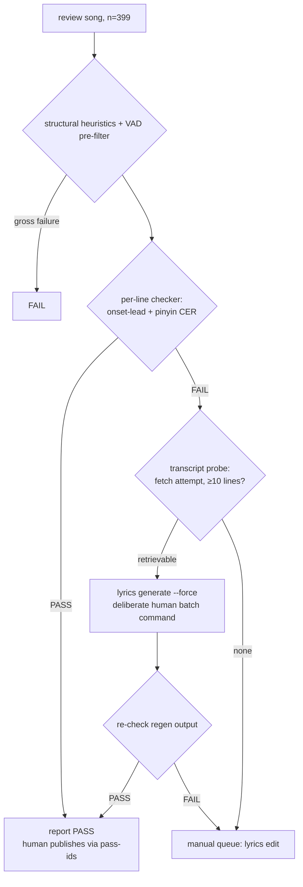

# LRC Review Triage — Checker + Cascade Design (v2)

Status: **design, not implemented**. Supersedes
`specs/lrc-review-triage-cascade-design.md` (v1, left unmodified for history).

**Changes vs v1:** (a) the positive and negative truth lists are no longer
frozen in the spec — they are DB queries snapshotted at experiment start, with
the negative list re-queried at the start of every later phase; v1's Appendix A
lists are demoted to seed lists used as regression anchors; (b) regen routing is
gated by an explicit transcript-retrievability probe (a read-only fetch attempt)
instead of letting the regen attempt itself discover transcript availability —
the deployed bug fix is scoped to the YouTube Transcription step, so regen on a
song with no retrievable transcript deterministically re-runs the known-poor
Qwen3 path; (c) a new Phase 1 feasibility gate validates that onset-lead
timecode accuracy can be reliably measured at all, with an explicit fallback
(content-only checker, no auto-PASS) if the timing signal proves unreliable.

Nothing in this spec permits automated writes to canonical LRCs, catalog status,
or visibility. Regeneration and publishing remain deliberate human commands.

## Problem

399 recordings sit in `review` visibility. Each must be categorized:

| Bucket | Definition (user-stated) | Action |
|--------|--------------------------|--------|
| **PASS** | Timestamps lead the first sung word of each line by ~2 beats; audio pronunciation matches the expected Mandarin of the lyric text | Human publishes (one command, e.g. pass-ids pipe) |
| **REGEN** | Poor LRC from the YouTube-transcript path *before key bug fixes*, on a song whose YouTube transcript is **retrievable today**. Post-fix YouTube path is high quality | `lyrics generate --force` |
| **MANUAL** | Qwen3-ASR/Whisper-path LRCs: missing/duplicated/mismatched lines after LLM correction, poor timecodes; forced alignment has not rescued many of them — plus any song with **no retrievable YouTube transcript**: regen would deterministically re-run the known-poor Qwen3 path (the fix is YouTube-step-only), so it is skipped | `lyrics edit` (manual correction) |

The manual loop (Preview listen → TAB re-timestamp → content fix vs structured
lyrics → `lyrics generate --force` for complex content failures) works but costs
a full listen per song. The goal of this experiment: **reproduce that judgment
automatically, validated against maintainer-supplied truth lists** — where the
truth lists are queried live from the DB at experiment start and the negative
list is re-queried at the start of every later phase, so maintainer feedback
accumulated mid-experiment joins the must-FAIL set.

## Measured Facts (2026-10-07, production DB via admin-cli)

1. **Review queue = 399**: `lrc_source` split is **390 NULL / 6 youtube_transcript /
   1 qwen3_asr / 2 manual_upload** (0 whisper_asr, 0 forced_alignment).
   `lrc_source` provenance only exists since 2026-09-23, so **metadata routing is
   decidable for 9 of 399 songs (~2%)**.
2. **All 399 have `recordings.youtube_url` set** — including the qwen3_asr
   negative (URL present, but transcript unavailable/disabled). youtube_url
   presence therefore does NOT imply the YouTube path can succeed; there is no
   free "regen can never help" bucket. Retrievability is decided by an
   **explicit fetch probe**, not by the regen attempt: the deployed fix is
   scoped to the YouTube Transcription step, so a no-transcript regen
   deterministically reproduces poor Qwen3 output (wasted DashScope/LLM spend).
   Probe primitive: `_fetch_transcript_draft`
   (`ops/admin-cli/src/stream_of_worship/admin/services/youtube.py:341`);
   **retrievable = probe returns ≥10 cleaned transcript lines**; RuntimeError /
   transcript disabled / fewer than 10 lines = not retrievable.
3. **LRC creation dates are not reliably recoverable**: R2 object Last-Modified
   is a mutable upload timestamp; the `lyrics.backup.{ts}.lrc` ladder is bounded.
   Date-based REGEN routing ("pre-fix vs post-fix") is dead for ~98% of the
   population. The checker must carry the categorization on audio+content
   signals.
4. **Truth sets are live DB queries, snapshotted** (seed subsets in Appendix A):
   - **Positives**: `sow-admin audio list --visibility published --format ids`,
     snapshotted at experiment start. The 46-song v1 list is a hand-verified
     subset of this query's result (all `published`, all `lrc_source` NULL,
     per-line ground truth from the editor); it is retained as the **seed** and
     regression anchor. If the published snapshot excludes a seed positive
     (e.g. unpublished since), the seed list stays authoritative for that song
     and the divergence is noted in the snapshot JSON.
   - **Negatives**: `sow-admin lyrics feedback list --rating poor --format ids`,
     snapshotted at experiment start and **re-queried at the start of every
     later phase** — the list grows with maintainer feedback, and new entries
     join the must-FAIL set. The 8 v1 negatives (6 youtube_transcript,
     1 qwen3_asr, 1 manual_upload anomaly) are the seed subset.
   - MANUAL-bucket validation is thin (n=1); synthetic corruption (Phase 3)
     compensates.
5. **Truth-list and probe primitives already exist** (no new CLI surface
   required):
   - `sow-admin audio list --visibility published --format ids` —
     `ops/admin-cli/src/stream_of_worship/admin/commands/audio.py:1502,1538`
     (`--visibility` filter, `--format ids` emits one song ID per line).
   - `sow-admin lyrics feedback list --rating poor --format ids` —
     `ops/admin-cli/src/stream_of_worship/admin/commands/lyrics.py:101-118`
     (open `--rating poor` feedback, `--format ids` pipeable).
   - `_fetch_transcript_draft(url)` —
     `ops/admin-cli/src/stream_of_worship/admin/services/youtube.py:341`;
     youtube-transcript-api, zh-manual → zh-generated → en preference, returns
     `TranscriptDraft(lines=[...])`, raises RuntimeError on failure.
6. **April experiment** (`specs/experiment_with_lrc_eval_approaches.md`,
   `reports/lrc_signal_experiment_summary_2026-04-28.md`): of 7 signals tested,
   only Silero VAD voiced-fraction separated known-bad from known-good
   (0.235 vs 0.726), and it only catches *gross* drift (lines landing in
   silence). DTW saturates on repetitive phrases; onset/tone too noisy;
   Qwen3-aligner drift inverts on long songs. Fine offsets (~±300ms), lead-in
   violations, and content errors are invisible to it.
7. **`lab/poc-scripts/eval_lrc.py` is the existing per-line ASR checker**:
   engines whisper/sensevoice/paraformer, pinyin word-level timestamps,
   homophone mode, segment modes `lrc`/`vad`/`none`. **Circularity caveat:** the
   default `lrc` segment mode splits audio by the very timestamps under test;
   timing judgment MUST use `--segment-mode vad` (or `none` as sanity arm).
8. **Forced alignment is structurally content-blind** (fed the LRC's own text)
   and has a masking defect: `map_segments_to_lines`
   (`ops/analysis-service/.../workers/forced_alignment.py:57-100`) fabricates
   ratio-proportional timestamps for lines it cannot locate. Consequence:
   regen output must always be re-checked; a plausible-looking regen LRC proves
   nothing. (Fixing that fallback is a separate defect, out of scope here.)
9. **TTS round-trip scorer** (`score_lrc_quality.py`): Mac-only (mlx-audio),
   timing-blind (scored known-bad dan_dan_ai_mi_249 at 0.950). Not used.
10. **Hardware**: dev box is linux x64, no GPU. All experiment models must be
    CPU-feasible: Silero VAD, faster-whisper (int8), SenseVoice. Stem separation
    (BS-Roformer + UVR de-echo → `clean_vocals.flac`) runs serially only
    (memory starvation otherwise).
11. **Editor internals**: TAB is a naive playback-position stamp (no beat snap);
    editor state knows BPM (quarter-note padding). Human TAB corrections carry
    ~100–300ms reaction-time noise — a floor under any tolerance.

## Design: Checker + Cascade (no metadata routing)



Key decisions and why:

- **Probe-first routing replaces regen-attempt discovery.** "Will regen help?"
  is decided by an explicit transcript-retrievability probe on every
  checker-FAIL song, *before* any regen is queued. v1 let the regen attempt
  itself discover transcript availability; that is now known to be wasteful —
  the deployed fix is scoped to the YouTube Transcription step, so a
  no-transcript regen deterministically re-runs the known-poor Qwen3 path and
  burns DashScope/LLM spend to produce another poor LRC. Probe properties:
  read-only network fetch (no canonical writes); paced ≥2s between fetches; one
  retry on transient network errors; results cached per video_id in the run
  manifest; on systemic IP-blocking, stop, report, and let the maintainer
  decide (the YouTube Data API captions endpoint is the named alternate means).
  Probe self-check: on the 8 seed negatives it must report the 6
  youtube_transcript songs retrievable and the qwen3_asr song not retrievable
  (fact 2); the manual_upload anomaly's probe result is recorded, not asserted.
  No provenance recovery or source-inference classifier is built — the
  population facts (1–3) make them low-value engineering.
- **Report-only invariant.** The checker, probe, and triage runner perform zero
  writes to canonical LRC, catalog status, provenance, or visibility. Regen and
  publish are separate, human-invoked batch commands operating on the triage
  report (manifest-tracked, resumable, per existing `lyrics generate` patterns).
- **VAD stays as a cheap pre-filter only** (existing tiers: PASS ≥ 0.70,
  FAIL < 0.55 mean voiced-fraction, ≥2 silent lines to suppress the t=0 intro
  false positive). It cheaply fast-fails gross drift; it never passes a song
  on its own.
- **Re-check after regen is mandatory** (fact 8).

## Checker Signals

Computed per sung line from `clean_vocals.flac` (fall back to `vocal.wav`,
never the full mix), via `eval_lrc.py --segment-mode vad`:

1. **Onset-lead (beats)** — timing. For each LRC line, locate the line's first
   word in the ASR word stream (pinyin, homophone-tolerant), take its onset,
   and compute `lead = (onset − lrc_timestamp) × BPM / 60`. BPM from the
   existing allin1 analysis (the editor already uses it for quarter-note
   padding). PASS criterion: distribution-calibrated window (Phase 3); prior
   expectation is lead ∈ [1, 3] beats for ≥90% of sung lines, AND no sung
   line's timestamp >200ms *after* its onset (late is strictly worse than
   early). ADR-0008 empty placeholder lines are excluded from scoring.
   Conditional on the Phase 1 feasibility gate; if the gate fails this signal
   is dropped and the checker becomes content-only (see Phase 1 fallback).
2. **Pronunciation/content (pinyin CER)** — content. Character-error rate
   between the ASR transcription and the LRC text over the line's vocal span,
   homophone-normalized. Catches missing, duplicated, and mismatched lines —
   the failure modes of the Qwen3-ASR path. Must tolerate ADR-0008 placeholder
   lines and line splits/merges (fuzzy line matching; the structured-lyrics
   aligner is prior art).
3. **VAD voiced-fraction** — pre-filter only (fact 6).

## Experiment Plan

Assets and scripts live in `lab/poc-scripts/` (extending `eval_lrc.py`, not
rebuilding it). Truth lists are DB-query snapshots written by Phase 0; the
Appendix A seed lists are checked in as regression anchors.

- **Phase 0 — assets.**
  - Run the two truth-list queries: `sow-admin audio list --visibility
    published --format ids` → `eval/lrc_truth/positive.txt`;
    `sow-admin lyrics feedback list --rating poor --format ids` →
    `eval/lrc_truth/negative.txt`. Write a snapshot JSON alongside (query
    timestamps, counts, seed-subset assertions: seed positives ⊆ published
    snapshot, seed negatives ⊆ feedback-poor snapshot; divergences recorded
    per fact 4).
  - Snapshot the 399-song review queue (song_id, hash_prefix, lrc_source,
    lrc_status, youtube_url presence) to JSON.
  - Cache audio + generate `clean_vocals.flac` serially — sized to the songs
    each phase actually uses, not the full 399.
  - Mine real before/after ground truth: R2 `lyrics.backup.{ts}.lrc` ladders and
    `user_lrc_override.lrc_content`. Pair a backup with its successor ONLY when
    the successor's `lrc_source ∈ {manual_upload, llm_edit}` — never diff two
    machine outputs. Inspect the manual_upload negative.
- **Phase 1 — timecode feasibility gate.** Small scale (10 songs: 5 seed
  positives + 5 seed negatives including the qwen3_asr and manual_upload
  negatives). Question: can onset-lead timecode accuracy be reliably determined
  at all, before any calibration/full-run commitment? Run
  `eval_lrc.py -e whisper --segment-mode vad` on `clean_vocals.flac`; compute
  per-line onset-lead from ASR word timestamps vs LRC timestamps (BPM from the
  existing allin1 analysis). Two tests:
  - **(a) Separation** — positives vs negatives onset-lead distributions:
    timing-attributed negatives must separate from positives.
  - **(b) Recoverability** — inject synthetic uniform offsets (+0.5s, +1.0s)
    into positive LRCs, re-measure, compare recovered vs injected offset.
  - **Gate (both required)**: (b) recovered mean offset within ±0.25s of the
    injected value on ≥90% of sung lines for ≥8/10 songs; (a) timing-attributed
    negatives separate from positives.
  - **Fallback if the gate fails**: drop signal 1; the checker becomes pinyin
    CER + VAD pre-filter only. The PASS bucket is then not automatable (PASS
    requires the ~2-beat lead), so the report degenerates to a
    REGEN-probe/MANUAL split with no auto-PASS, and the Success Criteria are
    restated accordingly (precision/recall apply to FAIL detection only).
  - Engine for the probe: Whisper large-v3 (cheapest — already a service dep).
    The engine bake-off (Phase 2) still runs after the gate; if the gate fails
    with Whisper it MAY be retried once with the bake-off winner before the
    fallback is adopted.
- **Phase 2 — engine bake-off.** Whisper large-v3 vs SenseVoice, vad
  segmentation, on a stratified subset (~10 songs: 5 seed positives + 5 seed
  negatives including the qwen3_asr and manual_upload negatives — the Phase 1
  set is reused). Pick the engine with the wider separation margin on both
  signals (on the content signal only, if the Phase 1 gate failed). Whisper is
  operationally cheaper (already a service dep) but is non-independent for
  whisper_asr-generated songs (0 in today's review queue; matters for future
  catalog sweeps) — SenseVoice is independent of all three generators.
- **Phase 3 — calibration.**
  - Re-query the negative list (`lyrics feedback list --rating poor
    --format ids`) before any measurement; new entries join the must-FAIL set.
  - Measure the onset-lead distribution over the positive snapshot → propose
    the PASS window → **maintainer confirms** (measure-then-confirm; the window
    is the scoring function and is meaningless if it doesn't match the manual
    standard). If the snapshot exceeds 60 songs, use a seeded random sample of
    60 (serial stem-separation bound; if ≤60, use all of it). Skipped if the
    Phase 1 gate failed.
  - Synthetic corruption sweep on positives: uniform offsets
    (+0.2/0.5/1.0/2.0s), linear drift, per-line jitter, dropped lines,
    duplicated lines → sensitivity curve: minimum detectable offset, detection
    rate vs magnitude. Synthetic positives-bias risk is bounded by the
    confirmed tolerance (sub-tolerance error is "don't care" by definition).
    (Timing corruptions apply only if the timing signal survived Phase 1.)
  - Ecological validity: all negatives in the current snapshot (≥ the 8 seeds)
    must FAIL, with per-line attribution that matches the failure mode (timing
    vs content).
- **Phase 4 — full validation + triage run.** Freeze thresholds on the truth
  snapshots (positive sample from Phase 3 + full negative snapshot) → run all
  399 review songs → per-song JSON report (signals, verdict, bucket,
  `transcript_retrievable` for every FAIL song) + console summary. The
  transcript probe runs as part of the triage run on checker-FAIL songs
  (paced ≥2s, one retry, cached per video_id in the run manifest, per Design).
  Zero writes.
- **Phase 5 — cascade costing & dry-run.** Count checker-FAIL songs; partition
  by the cached probe results: **regen batch = checker-FAIL ∩
  transcript-retrievable**; **manual queue = checker-FAIL ∩ no-transcript,
  plus any regen-recheck failures** after the batch runs. Estimate regen cost
  (DashScope quota, LLM calls, stem-separation time). Present the regen batch
  and the sized manual queue for human approval before any execution.

## Success Criteria

- **Feasibility gate**: Phase 1 criteria met, or the timing-signal-dropped
  fallback is explicitly adopted (in which case the remaining criteria apply to
  the content-only checker and no auto-PASS is produced).
- **Recall on real negatives**: all negatives in the current feedback-poor
  snapshot (including the 8 seeds) flagged FAIL with correct failure-mode
  attribution.
- **Precision on positives**: ≥90% of the Phase 3 positive sample PASS after
  Phase-3 tolerance confirmation (false-fails route to a wasted regen —
  annoying, not dangerous; false-passes are the dangerous direction and are
  bounded by the sensitivity curve).
- **Sensitivity**: uniform offset ≥0.5s detected on ≥95% of synthetic
  corruptions; report the minimum detectable offset.
- **Output**: frozen thresholds, per-song JSON reports (including
  `transcript_retrievable` per FAIL song), a sized and costed regen batch
  (FAIL ∩ retrievable), and a sized manual queue (FAIL ∩ no-transcript plus
  regen-recheck failures) — all before a single write.

## Out of Scope

- **Editor acceleration** (batch audition, beat-snapped TAB, waveform overlay).
  Reconsider once Phase 5 sizes the manual queue; the editor remains the
  fix tool for the MANUAL bucket unchanged.
- **Auto-publish** and any automated canonical writes.
- **Source-inference classification** and LRC-date recovery (killed by facts 1–3).
- **Fixing `map_segments_to_lines` ratio-proportional fallback** — separate
  defect; noted here only because it mandates post-regen re-checks.
- **Porting the TTS scorer**, chunked alignment for >300s songs (the checker's
  ASR path has no 300s cap; the forced-alignment job does — relevant only if
  regen output routes through it).
- **Edits to the existing verification spec / issues #236–#240** — re-scoping
  those is a follow-up decision after experiment results.
- **Executing the experiment and any pipeline implementation** — this document
  is design only.

## Appendix A: Seed Truth Lists (snapshot 2026-10-07, superseded by DB queries at experiment start)

Seed positives (46, regression anchor for `eval/lrc_truth/positive.txt`):

```
zhu_a__wo_yao_gen_sui_mi_83163301 hereforyou_62e79ae9 ye_he_hua_ni_xi_afde0692
shi_jia_de_ai_288ba1c9 yi_sheng_jing_bai_mi_da2173d0 xin_kao_mei_yi_ju_ying_xu_df457941
jun_wang_jiu_zai_zhe_li_1c32724c xi_le_he_liu_6f4d65a7 wei_rao_wo_997c78c0
zai_zhe_li_9cdbc9e8 de_sheng_you_yu_ca88c8ec cong_zao_chen_dao_ye_wan_b035044f
wo_ke_wang_kan_jian_7788db93 wo_de_sheng_yin_dai_you_neng_li_c4082100
suo_you_de_rong_yao_gui_yu_mi_d671f1cb da_kai_tian_chuang_dda69298
geng_xiang_mi_07e6dd27 shui_shen_zhi_chu_68301d63 mei_hao_de_chuang_zao_3d42d76e
iwillsinghallelujah_wo_yao_chang_ha_li_lu_ya__f5b0bc26 he_deng_rong_yao_mei_li_de_zhu_b0ee74b5
wei_da_de_shen_fa92f6d2 da_shan_ke_yi_nuo_kai__zhu_de_ci_ai__8da4d2ce
de_sheng_de_xuan_gao_c1168cd3 wo_men_gao_ju_ye_su_de_ming_9d078cac
wo_zai_zhe_li_97e552ed wo_shi_tian_fu_de_hai_zi_73c3756b
dang_mi_zou_jin_wo_men_dang_zhong_3975a746 mi_shi_wo_de_shi_ge_83c516ec
ye_su_yong_yuan_zhang_quan_11c37c63 sheng_ling_de_huo_2a76916d
geng_shen_zhi_chu_872a8c58 mei_yi_tian_wo_xu_yao_mi_4f6d59fd
xian_shang_zun_rong_71b624f0 xing_shen_ji_de_shen_60d27779
quan_xin_de_sheng_ming_5a797042 yin_zhu_shi_jia_e5a7765f mi_yong_yuan_huo_zhu_f461da22
xi_le_quan_yuan_88cd7a75 pi_shang_zan_mei_yi_9621c199 zhu_mu_kan_ye_su_d9d7c511
zhu_ci_fu_ru_chun_yu_d1fce01c mi_jiu_shi_wei_yi_aae2bf2f
wei_you_zhu_ye_su_de_bao_xue_396220cd you_yi_wei_shen_c33ea762
rang_zan_mei_fei_yang__gu_dian_ban__6eedd5e5
```

Seed negatives (8, regression anchor for `eval/lrc_truth/negative.txt`):

```
bu_ting_zan_mei_mi_e937a9d3        (manual_upload — anomaly, inspect)
shu_bu_jin_71fba0ce                (youtube_transcript)
wo_neng_gei_ni_shen_me_03b2dcb2    (youtube_transcript)
jing_bai_ye_su_b08227a2            (youtube_transcript)
wo_jing_bai_mi__ye_su_e6dd6146     (youtube_transcript)
na_me_shen_de_ke_mu_ff92abd9       (youtube_transcript)
cang_shen_zhi_chu_39437ec0         (youtube_transcript)
ai_shi_wo_men_yong_gan_6d1865b8    (qwen3_asr)
```

## Appendix B: Review Queue Snapshot (2026-10-07)

| lrc_source | count |
|------------|-------|
| NULL (legacy) | 390 |
| youtube_transcript | 6 |
| qwen3_asr | 1 |
| manual_upload | 2 |
| **total** | **399** |

All 399 have `recordings.youtube_url` set. The 6 youtube_transcript negatives
in Appendix A are exactly the 6 youtube_transcript review songs.

## Appendix C: Reference Files

| File | Role |
|------|------|
| `lab/poc-scripts/eval_lrc.py` | Checker harness (multi-engine ASR, pinyin word timestamps; use `--segment-mode vad`) |
| `lab/poc-scripts/experiment_lrc_signals.py` | April experiment driver (VAD signal reusable as pre-filter) |
| `specs/experiment_with_lrc_eval_approaches.md` | April run book; negative results for DTW/onset/tone/qwen3-drift |
| `reports/lrc_signal_experiment_summary_2026-04-28.md` | VAD tiers (0.70/0.55) and catalog VAD table |
| `specs/lrc-timecode-verification-design.md` | Predecessor spec (#236–#240); constraints 1–8 still apply where noted |
| `specs/lrc-review-triage-cascade-design.md` | v1 of this design (unmodified; historical) |
| `docs/agent_instructions-fix-lrc.md` | Manual loop this augments; fallback for the MANUAL bucket |
| `docs/lrc-job-flow.md` | Pipeline reference (YouTube → Qwen3 ASR → Whisper) |
| `ops/admin-cli/src/stream_of_worship/admin/commands/audio.py:1502,1538` | Positive truth-list query: `sow-admin audio list --visibility published --format ids` |
| `ops/admin-cli/src/stream_of_worship/admin/commands/lyrics.py:101-118` | Negative truth-list query: `sow-admin lyrics feedback list --rating poor --format ids` |
| `ops/admin-cli/src/stream_of_worship/admin/services/youtube.py:341` | Transcript-retrievability probe primitive: `_fetch_transcript_draft(url)` |
| ADR-0007 / ADR-0008 | Feedback advisory; gap placeholders (checker tolerance requirement) |
