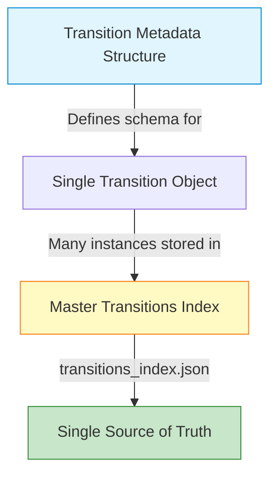
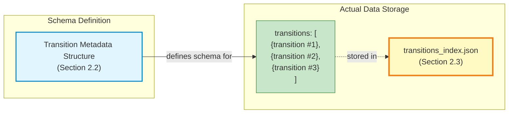

# Transition Generation & Review System Enhancement

**Version:** 2.0
**Date:** 2026-01-05
**Status:** Design Document

## Overview

Enhancement to the section-level transition generation system to support multiple transition lengths, comprehensive metadata storage, and human review workflow with feedback collection.

---

## 1. Transition Length Variants

### 1.1 Three-Tier System

Generate three versions of each transition to support different evaluation needs:

#### **Short Version (Crossfade Only)**
- **Content:** Last N seconds of section A → First N seconds of section B
- **Duration Options:** 6s, 8s, 10s, 12s (adaptive based on tempo score)
- **Use Case:** Quick evaluation of crossfade quality
- **Current Implementation:** ✅ Already implemented

#### **Medium Version (Single Section Context)**
- **Content:** Full last section of A + crossfade + Full first section of B
- **Crossfade:** 8s (fixed or adaptive)
- **Use Case:** Evaluate transition with immediate musical context
- **Implementation:** New
- **Example:** `[Chorus A full] --8s fade-- [Chorus B full]`

#### **Long Version (Extended Context)**
- **Content:** Last 2 sections of A (excluding outro) + crossfade + First 2 sections of B (excluding intro)
- **Crossfade:** 10s (fixed)
- **Use Case:** Full musical flow evaluation, best for human review
- **Implementation:** New
- **Example:** `[Verse A] [Chorus A] --10s fade-- [Chorus B] [Verse B]`

### 1.2 Section Selection Logic for Long Version

**Objective:** Select the last 2 sections before outro from Song A, and first 2 sections after intro from Song B.

**Section Source:** Sections are extracted from `poc_analysis_allinone.py` cache, which uses the **allin1 library** for ML-based structure detection. Each section includes:
- `label`: ML-predicted label (intro/verse/chorus/bridge/outro)
- `start`, `end`, `duration`: Temporal boundaries

**Algorithm:**
```python
def select_sections_for_long_transition(sections, target_section_index):
    """
    Select sections for long-form transition.

    Args:
        sections: List of all sections from allin1 analysis (ordered chronologically)
        target_section_index: Index of the primary section used in compatibility analysis

    Returns:
        (pre_section, main_section) for Song A exit
        (main_section, post_section) for Song B entry
    """
    # Filter out intro/outro
    content_sections = [s for s in sections if s['label'] not in ['intro', 'outro']]

    # For Song A: Get the target section and the one before it
    target_idx_in_content = content_sections.index(target_section)

    if target_idx_in_content > 0:
        pre_section = content_sections[target_idx_in_content - 1]
        main_section = content_sections[target_idx_in_content]
    else:
        # If target is first section, use it twice or just main section
        pre_section = None
        main_section = content_sections[target_idx_in_content]

    # For Song B: Get the target section and the one after it
    if target_idx_in_content < len(content_sections) - 1:
        post_section = content_sections[target_idx_in_content + 1]
    else:
        post_section = None

    return (pre_section, main_section, post_section)
```

**Fallback Behavior:**
- If only 1 content section available: Medium version becomes same as Short version
- If pre_section or post_section unavailable: Use only available sections

**Data Flow:**
1. `poc_analysis_allinone.py` generates cached analysis with allin1-detected sections
2. `analyze_sections.py` loads cached sections for each song
3. `generate_section_transitions.py` uses sections for all three variant types

---

## 2. Enhanced Metadata Schema

### 2.1 Overview: Storage Architecture

**Design Decision:** Use a **single Master Index JSON file** as the sole storage mechanism.

**Rationale:**
- **Simplicity:** No synchronization logic, no database overhead
- **Scale:** Sufficient for <1000 transitions (20 songs max)
- **Human-readable:** Easy to inspect, debug, and version control with git
- **Performance:** Fast enough for small datasets (load entire file into memory)

**Schema Components:**
1. **Transition Metadata Structure:** The blueprint/template for a single transition pair
2. **Master Transitions Index:** The single JSON file containing ALL transitions



**Data Flow:**
- **Transition Metadata Structure** (Section 2.2) = Schema/template defining what data each transition contains
- **Master Transitions Index** (Section 2.3) = Single JSON file with array of transition objects following the schema

#### Relationship Explained

**Transition Metadata Structure** is like a **class definition** or **database table schema**:
- Defines what fields exist (transition_id, compatibility scores, variants, review data)
- Specifies data types and structure
- Documents what each field means
- It's a **blueprint**, not actual data

**Master Transitions Index** is like a **collection of objects** or **database table with rows**:
- Contains the actual data for ALL transitions
- Each item in the `transitions` array is one instance following the schema
- Single file that holds everything
- The **only place** where transition data is stored



**Example Analogy:**

| Concept | Transition Metadata Structure | Master Transitions Index |
|---------|-------------------------------|--------------------------|
| **What it is** | Blueprint/Template | Actual data file |
| **Programming** | Class definition | Array of class instances |
| **Database** | Table schema (CREATE TABLE) | Table with rows (SELECT *) |
| **Construction** | House blueprint | Neighborhood of houses |
| **Count** | 1 schema document | 1 file with N transitions |

**Data Generation Flow:**
```
1. Run generate_section_transitions.py
   ↓
2. For each viable transition pair:
   - Create a dict following Transition Metadata Structure
   - Add to in-memory list
   ↓
3. Wrap all transitions in Master Index structure
   ↓
4. Save to transitions_index.json (single file)
```

**Data Review Flow:**
```
1. review_transitions.py loads transitions_index.json
   ↓
2. For each transition user reviews:
   - Update the 'review' fields in memory
   ↓
3. Save entire index back to transitions_index.json
   (atomic write - all changes saved at once)
```

---

### 2.2 Transition Metadata Structure (Schema)

```json
{
  "transition_id": "uuid-string",
  "generated_at": "2026-01-05T14:30:00",
  "version": "2.0",

  "pair": {
    "song_a": {
      "filename": "joy_to_the_world.mp3",
      "sections_used": [
        {
          "index": 3,
          "label": "verse",
          "start": 45.2,
          "end": 60.8,
          "duration": 15.6,
          "role": "pre_context"
        },
        {
          "index": 4,
          "label": "chorus",
          "start": 60.8,
          "end": 75.3,
          "duration": 14.5,
          "role": "primary_exit"
        }
      ]
    },
    "song_b": {
      "filename": "heaven_came_down.mp3",
      "sections_used": [
        {
          "index": 2,
          "label": "chorus",
          "start": 30.1,
          "end": 45.7,
          "duration": 15.6,
          "role": "primary_entry"
        },
        {
          "index": 3,
          "label": "verse",
          "start": 45.7,
          "end": 62.3,
          "duration": 16.6,
          "role": "post_context"
        }
      ]
    }
  },

  "compatibility": {
    "overall_score": 87.3,
    "components": {
      "tempo": {
        "score": 92.5,
        "weight": 0.25,
        "weighted_contribution": 23.1,
        "details": {
          "tempo_a": 128.3,
          "tempo_b": 130.1,
          "diff_bpm": 1.8,
          "diff_pct": 1.4
        }
      },
      "key": {
        "score": 100.0,
        "weight": 0.25,
        "weighted_contribution": 25.0,
        "details": {
          "key_a": "G major",
          "key_b": "G major",
          "relationship": "identical"
        }
      },
      "energy": {
        "score": 85.0,
        "weight": 0.15,
        "weighted_contribution": 12.8,
        "details": {
          "energy_a_db": -8.2,
          "energy_b_db": -7.1,
          "diff_db": 1.1
        }
      },
      "embeddings": {
        "score": 75.3,
        "weight": 0.35,
        "weighted_contribution": 26.4,
        "details": {
          "stems_used": "all",
          "similarity": 0.753
        }
      }
    }
  },

  "variants": [
    {
      "variant_type": "short",
      "crossfade_duration": 8.0,
      "total_duration": 8.0,
      "filename": "transition_short_joy_chorus_heaven_chorus_8s.flac",
      "file_size_mb": 2.3,
      "audio_specs": {
        "sample_rate": 44100,
        "channels": 2,
        "format": "FLAC"
      }
    },
    {
      "variant_type": "medium",
      "crossfade_duration": 8.0,
      "total_duration": 38.1,
      "sections_included": {
        "song_a": ["chorus"],
        "song_b": ["chorus"]
      },
      "filename": "transition_medium_joy_chorus_heaven_chorus_8s.flac",
      "file_size_mb": 8.7,
      "audio_specs": {
        "sample_rate": 44100,
        "channels": 2,
        "format": "FLAC"
      }
    },
    {
      "variant_type": "long",
      "crossfade_duration": 10.0,
      "total_duration": 72.3,
      "sections_included": {
        "song_a": ["verse", "chorus"],
        "song_b": ["chorus", "verse"]
      },
      "filename": "transition_long_joy_chorus_heaven_chorus_10s.flac",
      "file_size_mb": 16.5,
      "audio_specs": {
        "sample_rate": 44100,
        "channels": 2,
        "format": "FLAC"
      }
    }
  ],

  "review": {
    "status": "pending",  // pending, reviewed, approved, rejected
    "reviewed_at": null,
    "reviewer_notes": "",
    "ratings": {
      "overall": null,           // 1-10 scale
      "theme_fit": null,         // 1-10 scale
      "musical_fit": null,       // 1-10 scale
      "energy_flow": null,       // 1-10 scale
      "lyrical_coherence": null, // 1-10 scale
      "transition_smoothness": null  // 1-10 scale
    },
    "preferred_variant": null,   // "short", "medium", "long", or null
    "recommended_action": null,  // "use_in_setlist", "needs_refinement", "discard"
    "tags": []  // e.g., ["christmas", "high_energy", "key_change_works"]
  },

  "technical_notes": {
    "adaptive_duration_used": true,
    "section_fallbacks_applied": false,
    "warnings": []
  }
}
```

### 2.3 Master Transitions Index (Single Source of Truth)

**File:** `poc_output/section_transitions/metadata/transitions_index.json`

**Purpose:** Single JSON file containing ALL transition metadata - the only storage location.

```json
{
  "schema_version": "2.0",
  "generated_at": "2026-01-05T14:30:00",
  "configuration": {
    "min_score_threshold": 60,
    "weights": {
      "tempo": 0.25,
      "key": 0.25,
      "energy": 0.15,
      "embeddings": 0.35
    },
    "embedding_stems": "all"
  },
  "statistics": {
    "total_transitions": 45,
    "total_pairs": 15,
    "reviewed_count": 0,
    "approved_count": 0,
    "total_storage_mb": 234.5
  },
  "transitions": [
    { /* Transition Metadata Structure #1 */ },
    { /* Transition Metadata Structure #2 */ },
    { /* Transition Metadata Structure #3 */ },
    // ... all transitions (array of transition objects)
  ]
}
```

**Key Points:**
- ✅ Single source of truth - no sync issues
- ✅ Load entire file, modify in memory, save atomically
- ✅ Git-friendly - track changes to reviews over time
- ✅ Simple backup - just one file
- ✅ Sufficient performance for <1000 transitions (~5-10 MB file)

**Usage Pattern:**
```python
# Load
with open('transitions_index.json') as f:
    index = json.load(f)

# Modify
for t in index['transitions']:
    if t['transition_id'] == target_id:
        t['review']['overall'] = 8
        t['review']['status'] = 'reviewed'

# Save atomically
with open('transitions_index.json', 'w') as f:
    json.dump(index, f, indent=2)
```

---

## 3. Filename Conventions

### 3.1 Naming Scheme

```
transition_{variant}_{song_a_base}_{section_a_label}_{song_b_base}_{section_b_label}_{duration}s.flac
```

**Examples:**
- `transition_short_joy_chorus_heaven_chorus_8s.flac`
- `transition_medium_joy_chorus_heaven_chorus_8s.flac`
- `transition_long_joy_verse-chorus_heaven_chorus-verse_10s.flac`

### 3.2 Directory Structure

```
poc_output/
└── section_transitions/
    ├── audio/
    │   ├── short/
    │   │   ├── transition_short_joy_chorus_heaven_chorus_6s.flac
    │   │   ├── transition_short_joy_chorus_heaven_chorus_8s.flac
    │   │   └── ...
    │   ├── medium/
    │   │   ├── transition_medium_joy_chorus_heaven_chorus_8s.flac
    │   │   └── ...
    │   └── long/
    │       ├── transition_long_joy_verse-chorus_heaven_chorus-verse_10s.flac
    │       └── ...
    └── metadata/
        ├── transitions_index.json      # ⭐ SINGLE SOURCE OF TRUTH
        ├── transitions_summary.csv     # Quick reference (exported from index)
        └── review_progress.json        # Review session tracking
```

**Storage Simplification:**
- ✅ **One JSON file** - `transitions_index.json` contains everything
- ✅ **No individual files** - no synchronization needed
- ✅ **CSV export** - generated from index for spreadsheet viewing
- ✅ **Review progress** - separate file to track which transitions have been reviewed

---

## 4. CLI Review Interface Design

### 4.1 Review Workflow

```
$ python poc/review_transitions.py

╔══════════════════════════════════════════════════════════════════════╗
║           Section Transition Review System v2.0                      ║
╚══════════════════════════════════════════════════════════════════════╝

Loaded 45 transitions (15 pairs) | Reviewed: 0 | Pending: 45

═══════════════════════════════════════════════════════════════════════
Transition 1/15
═══════════════════════════════════════════════════════════════════════

From: joy_to_the_world.mp3 [verse → chorus]
To:   heaven_came_down.mp3 [chorus → verse]

Compatibility Score: 87.3/100
├─ Tempo:      92.5/100 (128.3 → 130.1 BPM, diff: 1.4%)
├─ Key:       100.0/100 (G major → G major)
├─ Energy:     85.0/100 (diff: 1.1 dB)
└─ Embeddings: 75.3/100 (stems: all)

Available Variants:
  [1] Short  (8s)   - Crossfade only
  [2] Medium (38s)  - Full sections with crossfade
  [3] Long   (72s)  - Extended context (2 sections each)

───────────────────────────────────────────────────────────────────────
Commands:
  p <variant>  - Play variant (e.g., 'p 1', 'p short', 'p long')
  s            - Stop playback
  r            - Rate this transition
  n            - Next transition (without rating)
  b            - Previous transition
  q            - Quit and save progress
  h            - Help

> p long
▶ Playing: transition_long_joy_verse-chorus_heaven_chorus-verse_10s.flac
  Duration: 72.3s | Press 's' to stop

  [████████████████░░░░░░░░] 60.2s / 72.3s

> r
───────────────────────────────────────────────────────────────────────
Rate Transition: joy_to_the_world [chorus] → heaven_came_down [chorus]
───────────────────────────────────────────────────────────────────────

Overall Quality (1-10): 8

Theme Fit (1-10): 9
Musical Fit (1-10): 8
Energy Flow (1-10): 7
Lyrical Coherence (1-10): 8
Transition Smoothness (1-10): 9

Preferred Variant [short/medium/long]: long

Recommended Action:
  [1] Use in setlist
  [2] Needs refinement
  [3] Discard
Choice: 1

Additional Notes (optional):
> Great flow, slight energy dip in middle but recovers well

Tags (comma-separated, optional):
> christmas, high_energy, smooth_transition

✓ Saved! (1/15 reviewed)

> n
```

### 4.2 Review Progress Tracking

```json
{
  "session_started": "2026-01-05T14:30:00",
  "last_updated": "2026-01-05T15:45:00",
  "total_transitions": 15,
  "reviewed_count": 8,
  "current_index": 8,
  "review_sessions": [
    {
      "session_id": 1,
      "started": "2026-01-05T14:30:00",
      "ended": "2026-01-05T15:45:00",
      "transitions_reviewed": 8,
      "duration_minutes": 75
    }
  ]
}
```

### 4.3 Keyboard Controls During Playback

- `Space` - Pause/Resume
- `s` - Stop
- `←` / `→` - Seek backward/forward 5s
- `[` / `]` - Adjust volume
- `q` - Stop and return to menu

---

## 5. Implementation Plan

### Phase 1: Enhanced Generation (Priority 1)

**Files to modify:**
- `poc/generate_section_transitions.py`

**New functions:**
```python
def select_sections_for_long_transition(sections, target_idx)
def generate_medium_transition(song_a_path, song_b_path, section_a, section_b, crossfade_dur)
def generate_long_transition(song_a_path, song_b_path, sections_a, sections_b, crossfade_dur)
def generate_all_variants(pair_info, section_features_map, audio_dir)
```

**Changes:**
1. Load all sections from allin1 analysis cache (already detected by `poc_analysis_allinone.py`)
2. Implement section selection logic for medium/long variants
3. Generate all 3 variants per pair
4. Update metadata schema to v2.0
5. Organize output into new directory structure

**Prerequisites:**
- `poc_analysis_allinone.py` must be run first to generate cached section data
- Section data includes ML-predicted labels from allin1 library

**Estimated Output Size:**
- Short: ~3-5 MB per transition
- Medium: ~10-15 MB per transition
- Long: ~20-30 MB per transition
- For 15 pairs: ~400-600 MB total

### Phase 2: Review CLI (Priority 2)

**New file:**
- `poc/review_transitions.py`

**Dependencies:**
- `sounddevice` or `pygame` for audio playback
- `rich` for terminal UI (optional, nice-to-have)

**Core functions:**
```python
def load_transitions_index()
    # Load entire transitions_index.json into memory

def play_audio(filepath, blocking=False)
    # Play audio file with controls

def stop_playback()
    # Stop current playback

def collect_rating_input(transition)
    # Interactive prompts for ratings

def save_transitions_index(index)
    # Save entire index back to JSON (atomic write)

def update_review_progress()
    # Track session progress separately

def export_summary_csv()
    # Generate CSV from index for spreadsheet viewing
```

**Features:**
- ✅ Simple workflow: load → modify in memory → save
- ✅ Sequential review with audio playback
- ✅ Progress persistence (separate file)
- ✅ No synchronization logic needed
- ✅ Atomic saves (all-or-nothing writes)

### Phase 3: Analysis & Reporting (Priority 3)

**New file:**
- `poc/analyze_feedback.py`

**Features:**
- Correlation analysis: compatibility scores vs. human ratings
- Identify which score components best predict human preference
- Generate recommendations for weight tuning
- Export insights for setlist building

---

## 6. Data Validation & Quality Assurance

### 6.1 Pre-Generation Validation

```python
def validate_pair_for_long_transition(sections_a, sections_b, target_a_idx, target_b_idx):
    """
    Ensure sufficient sections exist for long transition.

    Returns: (is_valid, warnings)
    """
    content_a = [s for s in sections_a if s['label'] not in ['intro', 'outro']]
    content_b = [s for s in sections_b if s['label'] not in ['intro', 'outro']]

    warnings = []

    if len(content_a) < 2:
        warnings.append(f"Song A has only {len(content_a)} content section(s), long version will be limited")

    if len(content_b) < 2:
        warnings.append(f"Song B has only {len(content_b)} content section(s), long version will be limited")

    return (True, warnings)  # Still valid, just warn
```

### 6.2 Post-Generation Verification

- Verify all audio files exist and are playable
- Check file sizes are within expected ranges
- Validate metadata completeness
- Ensure transition durations match specifications

---

## 7. Future Enhancements (Out of Scope for v2.0)

1. **SQLite Migration:** If dataset grows beyond 1000 transitions or query performance becomes an issue
   - Migrate from JSON to SQLite for efficient querying
   - Keep JSON export capability for git tracking
   - See design discussion in specs for trade-off analysis

2. **Web UI:** Browser-based review interface with waveform visualization

3. **Automatic Setlist Builder:** Use ratings to generate optimized worship setlists

4. **Beat-Aligned Transitions:** Snap crossfade points to beat boundaries

5. **Dynamic Time Stretching:** Tempo adjustment for better matching

6. **AI-Assisted Feedback:** Pre-populate ratings using ML model trained on human feedback

7. **Collaborative Review:** Multi-user feedback aggregation

8. **Export to DAW:** Direct export to Ableton/Logic with project files

---

## 8. Design Decisions (Resolved)

1. **Storage Architecture:** ✅ Single Master Index JSON file only
   - **Decision:** Use `transitions_index.json` as sole storage mechanism
   - **Rationale:** Simple, git-friendly, sufficient for <1000 transitions (20 songs max)
   - **No individual files:** Eliminates synchronization complexity
   - **No SQLite:** Keep it simple for initial phase, can migrate later if needed

2. **Storage Management:** ✅ No automatic cleanup - keep all transitions for comprehensive analysis

3. **Crossfade Duration for Variants:** ✅ Confirmed approach
   - Short: Adaptive (6-12s based on tempo score)
   - Medium: 8s (fixed)
   - Long: 10s (fixed)

4. **Section Boundary Detection:** ✅ Use allin1 library output from `poc_analysis_allinone.py`
   - ML-predicted labels (intro/verse/chorus/bridge/outro)
   - No manual override needed at this stage

5. **Playback Speed:** ✅ Standard 1.0x playback only
   - Focus on natural listening experience for quality evaluation

---

## 9. Success Metrics

**Technical:**
- Generate all 3 variants for 100% of viable pairs
- Zero file corruption or metadata inconsistencies
- Playback latency < 500ms in review interface

**Workflow:**
- Reduce review time per transition to < 3 minutes
- Enable review of 20+ transitions per hour
- 100% review completion persistence (no lost progress)

**Quality:**
- Collect comprehensive feedback for ML model training
- Identify weight tuning recommendations within 50 reviews
- Enable confident setlist building decisions

---

## 10. Dependencies

**Python Packages:**
```
# Core audio processing
librosa >= 0.10.0
soundfile >= 0.12.0
numpy >= 1.24.0
pandas >= 2.0.0

# Structure detection (prerequisite)
allin1  # For ML-based section segmentation via poc_analysis_allinone.py

# Review interface
sounddevice >= 0.4.6  # or pygame >= 2.5.0 for audio playback
rich >= 13.0.0  # optional, for better terminal UI
```

**System:**
- Audio playback capability (speakers/headphones)
- ~1 GB free disk space for testing (15 pairs × 3 variants)
- GPU recommended for faster allin1 analysis (prerequisite step)

---

## Appendix A: Metadata Schema Versioning

**v1.0 (Current):**
- Single crossfade variant per pair
- Basic compatibility scores
- No review capability

**v2.0 (Proposed):**
- Multi-variant support (short/medium/long)
- Detailed score component breakdown
- Review and feedback fields
- Enhanced technical metadata

**Migration Path:**
- v1.0 files remain valid for short variants only
- Generator adds `"version": "2.0"` field to new files
- Review tool ignores v1.0 files (or treats as short-only)
